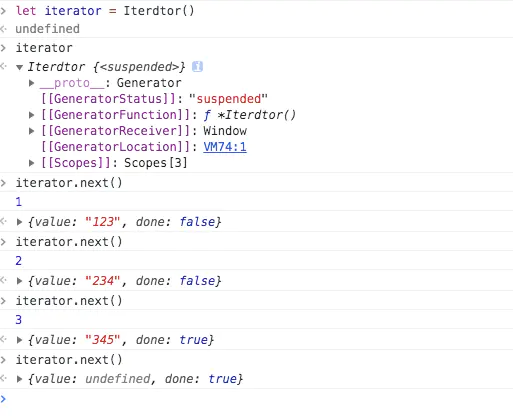
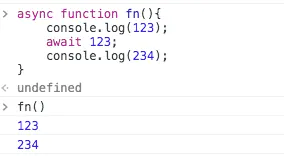
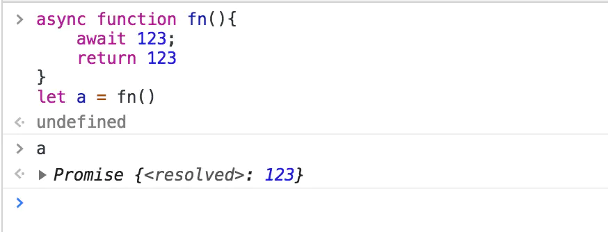
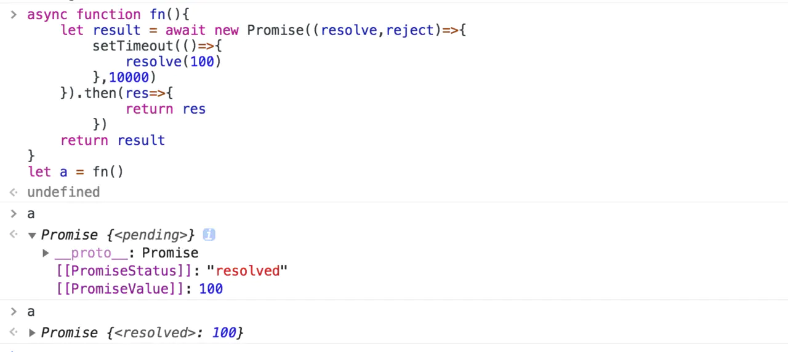

## 不讲讲迭代器模式总觉得怪怪的
对于java语言来说，迭代器是一个很基本的模式，list与set结构都内置了迭代器。

但是javascript并没有这种结果（ps：ES6提供了set，而且也可以实现迭代器），但是我们对这种模式实用的并不是特别多。 迭代器模式是指提供一种方法顺序访问一个聚合对象中的各个元素，而又不需要暴露该对象的内部表示。

so：迭代器就是在不暴露对象的内部表示的情况下，能够遍历整个元素

核心嘛就是：不暴露内部，可以遍历内部

下面我们就来实现一个简单的迭代器

``` javascript
// 在数据获取的时候没有选择深拷贝内容，
// 对于引用类型进行处理会有问题
// 这里只是演示简化了一点
function Iterdtor(arr){
	let data = [];
    if(!Array.isArray(arr)){
        data = [arr];
    }else{
        data = arr;
    }
    let length = data.length;
    let index = 0;
    // 迭代器的核心next
    // 当调用next的时候会开始输出内部对象的下一项
    this.next = function(){
    	let result = {};
    	result.value = data[index];
    	result.done = index === length-1? true : false;
    	if(index !== length){
            index++;
            return result;
    	}
    	// 当内容已经没有了的时候返回一个字符串提示
    	return 'data is all done'
    };
}
let arr = [1,2,3,4,5,6];
// 生成一个迭代器对象。
let iterdtor = new Iterdtor(arr);
iterdtor.next()
iterdtor.next()
```


这就符合迭代器模式的特点，并没有暴露内部的对象， 通过next的方法可以遍历内部对象。

说到现在很多人应该还没理解为什么要说迭代器。

### Generator函数执行后会返回一个迭代器
## async函数是Generator的语法糖
这两个理由是不是一下子就说明写迭代器是很有用处的。

书写一个简单的Generator函数
```javascript
// 伪代码
let ajaxSign = false;
function *ajaxGetSomething(){
    ajaxSomethingOne().then(res=>{ajaxSign = true})
    yield
    ajaxSign = false;
    ajaxSomethingSecond().then(res=>{ajaxSign = true})
}
let iterator = ajaxGetSomething();
iterator.next();
while(ajaxSign){
    iterator.next()
}
```


我们执行了一下Generator函数返回一个迭代器。通过next方法，可以阻塞性的去执行Generator的代码。

一说到阻塞大家就想到同步等待阻塞线程导致页面十分卡顿，明明不是一件很好的事情，为什么要用这种东西呢？

下面我们就聊聊这种阻塞性的方式有什么好处呢？

在Generator函数中，迭代器调用next函数后，会一直执行到有yield标示的位置停止。等待next的下一次调用后，代码会继续执行到下个yield表示。没有yield的话就一执行到最后return的位置（没有return就会一直执行完所有的代码，这句话好像是个废话）。

代码就像挤牙膏一样，挤一点出一点挤一点出一点，最后没有卡顿的地方，一口气挤到底。

所以说如果实用Generator的方式来处理异步的请求会是怎样的一种感觉。
```javascript
// 伪代码
let ajaxSign = false;
function *ajaxGetSomething(){
    ajaxSomethingOne().then(res=>{ajaxSign = true})
    yield
    ajaxSign = false;
    ajaxSomethingSecond().then(res=>{ajaxSign = true})
}
let iterator = ajaxGetSomething();
iterator.next();
while(ajaxSign){
    iterator.next()
}
```
如果以这种方式来实现异步的请求会怎样?
1. 有一个标志代表ajax请求完成。
2. 当标志为true时代表ajax执行完成，可以进行下一个事件了。
3. 当标志为false代码ajax还未执行完成，继续阻塞下面的代码。
4. 当第一个标志为true时，执行next（），然后发现到下一个yield之间有异步的代码，将标志设置为false，开始执行ajax的事情，阻塞着后面的内容。
5. 当ajax完成后把标志设置为true，开始2的内容做的事情不断执行着直到整个迭代器完成。

### 粗俗的while循环实现next的调用是不可取的（毕竟伪代码）

这种方式让我们体会到另一种处理异步的方式，就是阻塞时的去执行多个串行的异步任务，这样可以感受同步的写法去书写异步的代码，也就不会在不合适的时间去拿去异步的产生的数据，你阻塞着线程，你不等他执行完，你取值的操作也做不了呀。

## 如何实用async await
说到这里如何使用他们就比较清晰明了了吧
```javascript
async function ajaxGetData(){
    xxxx
    dosomething()
    await ajaxGetDataFirst()
    dosomething()
    await ajaxGetDataSecond()
    dosomething()
    xxx
}
ajaxGetData()
```
这个时候我们使用async函数来处理异步效果就很清晰了，

我们做了一些事情，然后到一个异步的ajax请求后，等待ajaxGetDataFirst这个异步的事件执行完毕后，开始继续做一些事情，到了第二个ajax异步请求ajaxGetDataSecond（），开始执行阻塞住函数的执行，等待异步事件执行完毕后就继续做下面的事情。用await关键字的时候就是在告诉下面的代码，这块你得给我等着，wait我执行完了才能轮到你 understand？总之await吊极了。

await在什么时候可以用？ 只有在async函数体内部使用，而且这个作用范围是不可以继承下去的。


在promise中怎么使用async函数
```js
 new Promsie(async (resolve,reject)=>{
     await xxx
 })
 // 这样的async才能使await有效果，书写在promise之外的话await就会像上面一样报错
```
await 可以接收一个同步的事情吗？继续执行下去不阻塞

  

async函数的返回值是什么？async函数的返回值是一个promise对象,

？？？？ what 返回了一个promise对象。这有啥用呢？请听下面分析
这就代表着你在执行完所有的异步请求后还可以继续将你需要的结果用return的方式保存在一个promise对象中。promise的用处是什么？他好像可以存储一个值在指定情况下触发一个回调函数（这个不理解的可以看一下上一篇内容哈）所以这可以帮助我们把内部的异步请求的数据抛出到函数外部来。



下面的使用场景：

在使用场景中，我们有的时候需要异步的一个结果，比如ajax请求的结果，这个时候我们希望得到这个异步的结果怎么办？这个时候await可以帮助我，在执行完异步的操作的时候拿到结果，在拿到结果后顺序执行下去。直到return的时候把这个结果 return出去，

### 以下两种写法我们是都可以使用的
```js
async function fn(){
	let result = await new Promise((resolve,reject)=>{
		setTimeout(()=>{
            resolve(100)
		},10000)
	}).then(res=>{
			return res
		})
	return result
}
let a = fn()
```


```js
async function fn(){
	let result = await new Promise((resolve,reject)=>{
		setTimeout(()=>{
            resolve(100)
		},10000)
	})
	return result
}
let a = fn()
```


这两种方式都可以等待异步的promise执行完成之后再赋值给result，这个时候，我们返回的a就是一个pending状态的promise对象，上一章节我们讲过了promise的基本原理，后面的操作我就不多提了，所以得到你想要的内容的promsie你就会操作了。

这个时候我们async内的异步操作的结果自然而然的可以抛出到函数外部来使用，可以解决很多的业务的封装问题了。

## async 与 Generator的区别
async 与Generator的区别是什么？

async是Generator的语法糖，Generator是可以用来实现async的，用Generator来实现async的核心就是实现这种不需next调用自执行的内容，这是我以后要进行学习的（目前时间不是很充裕，打算学好之后出一个特别篇好好实现以下async）

