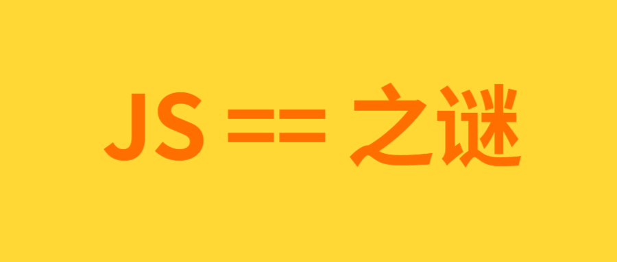

## 问题
先说说偶然遇到的一道题。当 a 是什么的时候，判断条件会成立？输出的 a 又是什么？
```js
var a = ???;
if(a == 1 && a == 12){
  console.log(a);
}
```
## 分析
首先可以肯定 a 不是字面量（比如数值或字符串），因为 a 不能同时等于多个值。

然后想到对象，如果 a 是对象，则在执行 == 比较的时候，会进行 valueOf 方法（或 toString）。

由此我们想到可以用自定义 valueOf 或 toString 方法来覆盖其原型方法。
```js
var a = {
  i: 1,
  valueOf: function() {
    if(this.i === 1){
      this.i++; // i 自增为 2，之后再次判断这里就不会执行了
      return 1;
    } else {
      return 12; // 第二次 == 比较，返回 12
    }
  }
}
if(a == 1 && a == 12) {
  console.log(a); // { i: 2, valueOf: [Function: valueOf] } 注意 i 已经自增为 2 了
}
```
## 另一种思考
a可以等于多个值，又可以想到数组；a也不可能同时等于多个不同的值，而在进行==比较的时候，数组会由join方法转换成字符串，因此可以改写join方法。（不太符合题意）
```js
var a = [1,12];
a.join = a.shift; // 其实这已经不符合题意了
if(a == 1 && a == 12 ) {
  console.log(a); // [ join: [Function: shift] ] 数组的shift方法会删除数组第一个元素 
}
```
## 类似问题  
这是原来那一道面试题。
```js
var a = ???;
if(a == 1 && a == 2 && a == 3) {
  console.log(a);
}
```
其实方法是类似的
```js
var a = {
  i: 1,
  valueOf: function() {
    return this.i++;
  }
}
if(a == 1 && a == 2 && a == 3) {
  console.log(a); // { i: 4, valueOf: [Function: valueOf] } 输出 a 对象，注意 i 的值
}
```