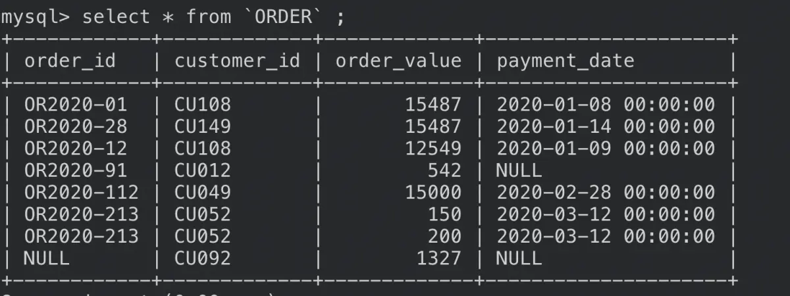

COUNT()函数是SQL的聚合函数之一。它返回满足括号中条件的函数，而不会返回行本身，经常用于生成SQL报表。常见的COUNT()函数有以下四种形式：
1. `COUNT(*)`
2. `COUNT(1)`
3. `COUNT(列名)`
4. `COUNT(DISTINCT 列名)`
---

我们便于展示内容，我们在如下表上进行测试：
 

---
## `COUNT(*)` VS `COUNT(1)`
两者没有区别，它们返回的结果是相同的。都是表的所有行。
 VS COUNT(1)")
### 常见误区：~~`COUNT(1)` 比 `COUNT(*)` 要快~~
有一种说法任务，COUNT(*)需要使用整张表来统计所有行数；而COUNT(1)只会计算第一列。 但其实括号中的数据不代表表中的列数，他可以为任何数字，甚至是字符串：
 比 COUNT(*) 要快")
### `COUNT()`函数括号中的值到底代表什么含义？
`COUNT`函数的意思是将括号中的值分配给每一行，然后计算被分配的次数，因此除了括号为空，其他*，1，2等值都会返回相同的结果；
建议使用`COUNT(*)`, 这种用法更加常见，也更清晰：用户能清楚的了解到这里是要统计表的行数。

---
## COUNT(*) vs COUNT(列名)
**两者有区别！**COUNT(column name)只会计算给定列不是 NULL 的行 ; COUNT(*) 将计算表中的所有行，包括NULL值;
 vs COUNT(列名)")

---
## COUNT(列名)与 COUNT(DISTINCT 列名)
**有区别！**` COUNT(DISTINCT 列名)` 会将列名去重，即相同的数据只会统计一次
与 COUNT(DISTINCT 列名)")

---
## 建表语句
```sql
CREATE TABLE  IF NOT EXISTS `ORDER` (
order_id VARCHAR(10),
customer_id VARCHAR(30) NOT NULL,
order_value BIGINT,
payment_date DATETIME
);

INSERT INTO `ORDER` VALUES('OR2020-01','CU108','15487','2020-01-08');
INSERT INTO `ORDER` VALUES('OR2020-28','CU149','15487','2020-01-14');
INSERT INTO `ORDER` VALUES('OR2020-12','CU108','12549','2020-01-09');
INSERT INTO `ORDER` VALUES('OR2020-91','CU012','542',NULL);
INSERT INTO `ORDER` VALUES(NULL,    'CU092','1327', NULL);
INSERT INTO `ORDER` VALUES('OR2020-112','CU049','15000',    '2020-02-28');
INSERT INTO `ORDER` VALUES('OR2020-213','CU052','150',  '2020-03-12');
INSERT INTO `ORDER` VALUES('OR2020-213','CU052','200',  '2020-03-12');
```