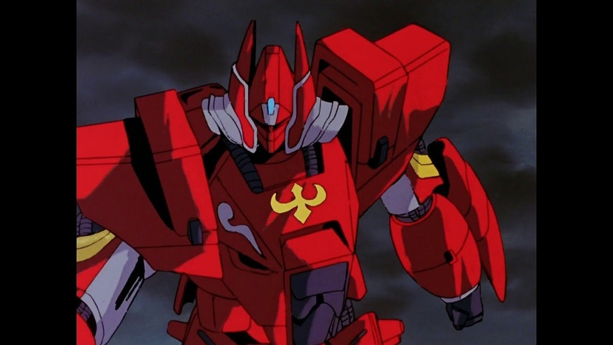
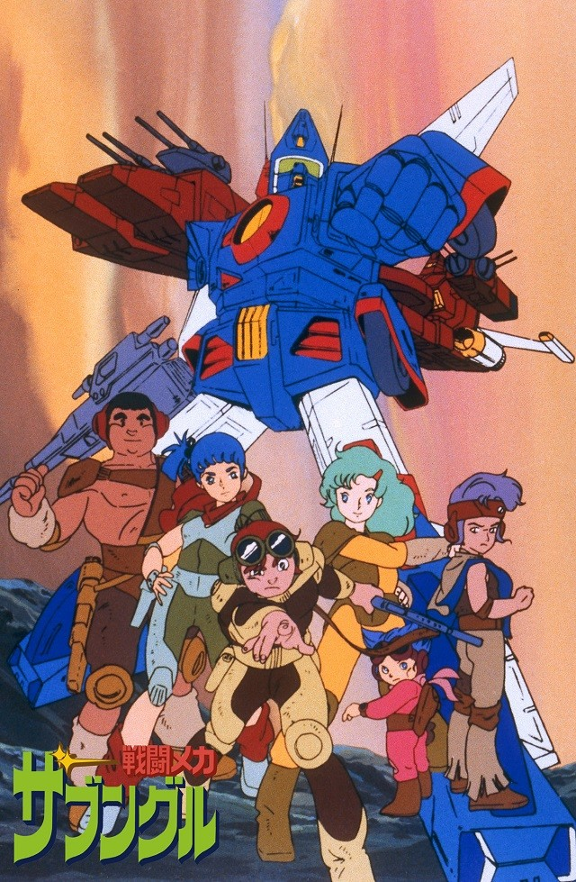
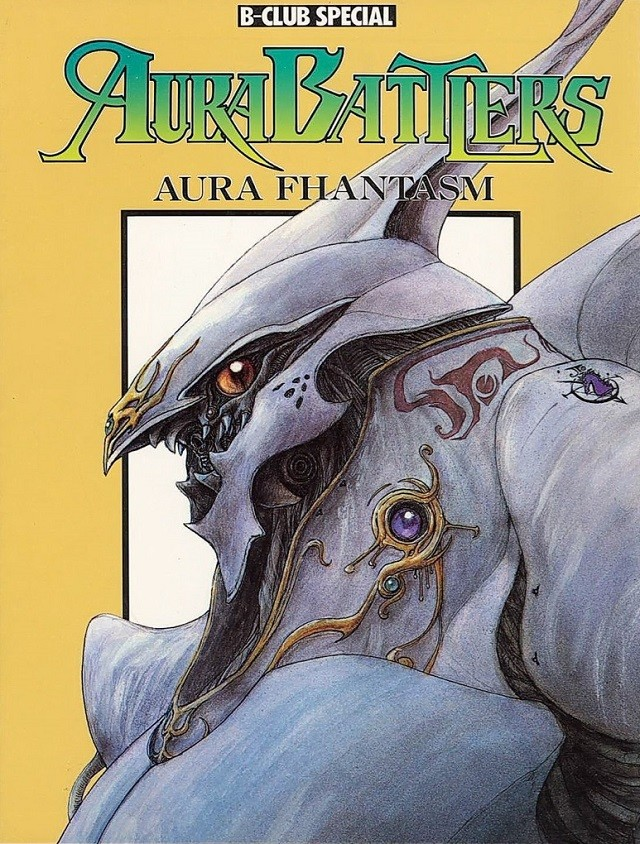
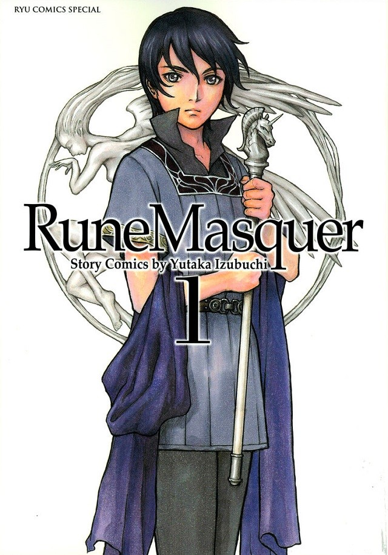
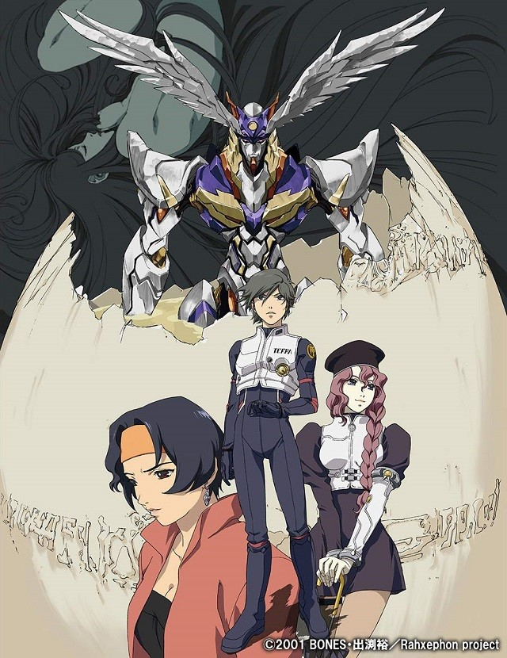
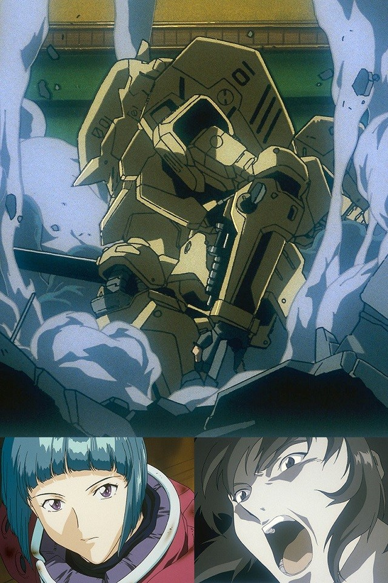

>封面：《机甲界加里安 铁之纹章》

说起出渊裕设计的机器人，大家一般都会先想到《机动战士高达 逆袭的夏亚》的 RX-93 ν高达、《机动战士高达0080 口袋里的战争》的 NT-1 阿雷克斯、《机动警察Patlabor》的 AV-98 英格拉姆等等。

不过，年纪轻轻不到 20 岁就已经进入动画业界出渊裕当年的工作重心并非这些等同于主角机器人，而是每一话都被主人公们打到的敌方机器人，俗称“杂兵机”，作为专门设计“杂兵机”的设计师，出渊裕在制作现场占有一席之地。而这些“杂兵机”也都蕴含着对故事对作品的独特美学。

出渊最初设计的敌兵机是在《斗将戴莫斯》的时候，最初的敌兵机由担当角色设计的漫画家圣悠纪老师负责，然而圣悠纪虽然画得了太空船，但却对敌兵机不拿手。接着长浜忠夫监督又让另一位漫画家蛭田充试着画了敌兵机，再由出渊接手。

当时出渊正准备高考，仅仅是以一名爱好者的身份到工作室参观学习，这时出渊将自己过去的画作给长浜看，长浜便对他说，“要不要来试试看？”长浜监督是个表里如一的人，他说好那就是好，他的赞扬也让出渊的心情畅快了许多。出渊把长浜比作是山田风太郎的小说中出现的怪异忍者，每回都要有通过完全不同的战斗来构成的想法。

当时的机器人动画，包括《斗将戴莫斯》在内，基本上只要主角方的机器人通过了赞助商的许可，之后的设计基本不会过问。不过，在长浜监督的作品中，戴莫斯的设计也是唯一由他亲自对主角机器人提出的要求。“脸不要太粗狂，要像《勇者莱汀》里的夏金王子一样俊俏。”但是，身体又是拖车，这样的平衡很难把握。这也使得戴莫斯在当时的主角机器人中显得鹤立鸡群。

《斗将戴莫斯》之后，紧接着就是《未来机器人 达尔塔尼亚斯》《宇宙大帝神圣西格玛》，出渊开始成为敌兵机的专门设计师。话虽如此，出渊却表示，自己虽然喜欢画画，但完全就是一介新人。而且，当时丝毫没有打算将来要设计主角机械。

就拿《假面骑士》来说，比起让自己考虑设计新的假面骑士，脑子里更多的是新修卡怪人和死铁龙怪人的设计。当时大河原邦男也问过他，“不考虑设计主角机械吗？”出渊毫不犹豫地拒绝了大河原的邀请，内心也是一心只想着设计敌兵机。

在出渊看来，设计主角机并不是很有意思。毕竟构成一部作品世界观的，不单纯是这些英雄们，而是衬托了他们英勇的敌方角色。拿战队英雄来说，出渊认为敌方战斗员更能够体现出作品的世界观。

同样，在《机动战士高达》里，更能代表那个世界的不是高达，而是扎古。因为实用，观众很快就能够抓住作品的印象，这些观众要是占了八成，那出渊等人的工作就会变得更加顺利。

其实出渊当时还想给《斗将戴莫斯》的敌兵机都加上翅膀，单纯是希望在设计上让这群敌兵机能够让观众感受到统一，并不是一定要会飞，但因为自己是中途参加的，所以这套方案并没能“得逞”。如果是最初就参与到这个项目的话，自己也能提出意见，而且当时已经画好了几台带翅膀的敌兵机。

另外，《斗将戴莫斯》的中半部分，敌兵机已经单纯地从“战斗机器人”强化成了“机械战士”，因此在画面上得表现出合体机械的概念。尤其在美形的角色登场时，敌兵机在设计上也会多一份心。当时长浜监督也特别意识到照顾女性观众，因此美形角色尤其多。

过去并没有像现在这样能够让出渊熟虑的设计时间，通常订单下来没几天就必须得交稿，因此出渊在看完脚本的第 1 稿后就要开始设计。而且当时的敌兵机必须每周都出一台新的。不过当时只要草稿设计过得去，就能够给分镜师提供很好的点子，用在战斗和剧情的构成上。

担当作画监督的金山明博也会为了更好画，而将草稿设计再清稿一遍。出渊自己则是从《无敌机器人 托莱达G7》才开始清稿，因此他在《斗将戴莫斯》时画的设计，单纯是给作画用的灵感草稿。

---

在《最强机器人 大王者》的时候，因为是宇宙的水户黄门，因此出渊认为在这个世界观下即使出现像《星球大战》里的达斯·维达、风暴兵也是被允许的，谈不上好还是不好，那个时代就是这么随意。

那会儿出渊一直在 SUNRISE 的第 2 工作室，《未来机器人 达尔塔尼亚斯》的中盘，长浜监督因为参加《凡尔赛的玫瑰》换成了佐佐木胜利，于是出渊也就跟着佐佐木，在之后的《无敌机器人 托莱达G7》《最强机器人 大王者》也同样担当敌兵机的设计。

《最强机器人 大王者》之后，第 2 工作室进行了路线变更，换上了富野由悠季。出渊依然在第 2 工作室，因此参与了《战斗机械 萨芬格尔》。也就是说，当时的他并不是每一部就要跟着监督移动，而是得看第 2 工作室的人员变动。也因为如此，出渊结识了不少业内人士。

在《未来机器人 达尔塔尼亚斯》为止的 SUNRISE 都是接东映动画的外包工作，出渊也因而结识了之后制作了“超级战队”系列的铃木武幸和在动画、电视剧方面都有涉足的饭岛敬。

出渊还记得，《战斗机械 萨芬格尔》在富野由悠季监督加入之前是另一个标题，而且是科幻宇宙题材，监督是吉川惣司。和《无敌机器人 托莱达G7》《最强机器人 大王者》一样，由铃木良武担当系列构成，大河原邦男只担当主角机的设计，湖川友谦不仅负责角色设计也担当机械的设计。结果在企划中途，吉川退去了监督的位置，因为富野监督更加擅长宇宙题材的故事，因此换成了富野监督。

在之后的《银河漂流派法姆》中，富野监督也和神田武幸监督一起担当了原案，但因为在 1982 年那会儿，富野监督表示自己要去全盘负责《传说巨神伊迪安》的剧场动画，因此这边就交给了神田监督。这其实也是富野监督的服务精神，不然也不会接下《战斗机械 萨芬格尔》这个担子，并且提出了像西部剧那样的世界观。

不过这也只是推测，出渊认为富野监督当时是想做像《未来少年柯南》那样讲述普普通通的老百姓坚强生活的故事，因此才有了《战斗机械 萨芬格尔》中的用汽油引擎来发动的巨大机器人。因为最初的时候，富野监督力挺铃木良武，因此《战斗机械 萨芬格尔》在第 1 季度左右，铃木的个人风格更为强烈，比如“无论是谁犯下再严重的罪行，只要在三天内没被处理，就可以当作无罪”的这条规则。

《战斗机械 萨芬格尔》的大型步行机器（Waker Machine）就是由湖川友谦设计的，直接将当时吉川监督参加时的设计稿原封不动地用在动画中。沙漠老鼠旅团使用的悬浮机（Hobuggy）也是湖川设计，其余的悬浮机、悬浮运输车（Hover Truck）和沙漠船（Sand Ship）则均由出渊裕设计。

湖川的设计比起统一世界观，更重视崭新和有趣。Trad 11 型、Gallop 型、Crab 型等都是出渊基于湖川的原稿来设计，交由 BEBOW 的原画师进行清稿。Durun 型则是以富野的草稿为蓝本，由出渊画的设计稿。

紧接着《战斗机械 萨芬格尔》的《圣战士丹拜因》，由宫武一贵担当主角机的设计，论数量，出渊设计的奥拉战士要更多，不过当中也有像巴斯特鲁那样由 BEBOW 的新人原画师设计的机体。

湖川在《战斗机械 萨芬格尔》的时候，就经常将设计交给手下的新人，为的是将这些视觉要素过于强烈的设计更加自然地与动画结合在一起。包括主角机丹拜因在内，初期的奥拉战士都是以宫武的设计为基础，再由湖川清稿为作画用的线条。

---

在《圣战士丹拜因》的动画结束后，出渊与当时万代出版科的《B-CLUB》进行了另一个新的尝试，将丹拜因的世界更加靠近幻想的“if世界观”《AURA FHANTASM》。

当时的业界即使是让设计师自由发挥也不会被责怪，反而会受到读者玩家的支持，因此作为赞助商万代出版课就推出了像是《Cyber Comics》等诞生了数多“亚种”高达的书籍，《AURA FHANTASM》也是在这种状态下，由出渊随心所欲自由发挥。就算之后要出 GK，只要跟安井尚志通融下，就没太大的问题。

几乎同一时期，由高桥良辅监督的《机甲界加里安》于 1984 年开播。主角机加里安由大河原邦男设计，敌兵机方面，大河原和中村光毅也有画过设计稿。比如人马兵，就是基于中村光毅的草稿进行设计，关节凸起的部分就是直接照搬中村的草稿。

大河原的草稿设计过于科幻，而出渊的工作就是要将这些科幻式的设计改为重装铁甲的奇幻路线。不过《机甲界加里安》因为是从其他项目的分支改的企划，时间过于仓促。包括润色在内，出渊都不是很满意。

正为这股“不完全燃烧”的心情憋得慌的时候，突然得知要出 OVA 了，包括主角机加里安在内，都进行了重设计，这也就有了之后的《机甲界加里安 铁之纹章》。这时重新设计的机甲兵就有了当时出渊裕浓厚的个人风格，也是他认为迄今已来最棒的工作之一。出渊的设计也让不少原型师、造形家食指大动，之后也制成了 GK 进行贩卖。只可惜当时的设计本身是直接买断的，所以这笔钱没能进到出渊的口袋里。

这套设计出渊花了很多心思在里面，从《铁之纹章》起出渊开始思考是否能将这些设计翻新成自己的原创设计。正巧当时出渊和海洋堂方面谈到了关于原创机器人模型展开的话题。当时还是海洋堂专务的宫胁修一也对《铁之纹章》的机甲兵颇为中意，他希望能有“半神半兽的奇幻机器人”。

如此一来，这些设计的权利就掌握在出渊自己的手里，所以他决定与其合作。此时，出渊的老相好、编辑安田猛这会儿正准备设立一本新的漫画杂志《月刊DRAGON MAGAZINE》，向出渊伸出了橄榄枝。

最初如果是基于海洋堂模型的话，出渊觉得可行。之后安田希望出渊能够出一部漫画，出渊首先联想到的就是让结城信辉来画，世界观和故事的构成则由自己来负责。《机神幻想Rune Masquer》单行本和 GK 都卖得好，不再是买断设计版权，而是自己的原作，出渊也感叹到这么多年的努力总没算没有白费。

同一时期，出渊还接手了《罗德斯岛战记》的插画，从小说插画到漫画到角色设计都有自己一手包揽，也是他第一次担当角色的设计。出渊原本就喜欢妄想空想世界，构思故事、撰写剧情、构筑世界观，这时期也可以说是他在之后成为动画监督的前段阶。

只不过当时出渊还没考虑要做监督。这是因为在他的记忆中，监督每天都得过着不眠不休的生活，出渊以机械设计的身份参与河森正治执导的剧场版《超时空要塞MACROSS～可曾记得爱～》时，他就在最近的距离看着一周只睡了 3 小时的河森。

---

在正式进军监督业前，出渊还负责了《机动警察Patlabor》新 OVA 版第 1 话、第 5 话的分镜，第 14 话的脚本和分镜。更早以前，在 1984 年时还受铃木武幸的邀请参与了《超电子生化人》，除了角色设计之外，还参与了脚本，虽然脚本最终没能完成，但故事的大纲留了下来，正片中也有被使用。

在《超电子生化人》中有着与人共存的机器人匹波和单纯执行程序的猎人机器人席鲁巴，在设计上，出渊刻意赋予了他们共通点。另外，为了让新帝国 GEAR 的统帅 Doctorman 和与自己的儿子几乎一致的机械人 Prince 之间有牵连，提出了让 Prince 再出场的想法。

不仅如此，出渊还安排了，身为敌方的机械人为了得到良心回路而觉醒了人性的机器人少女，与其链接着的不死身机械贾刚的故事大纲。虽然现在回想起来，出渊觉得自己当年真是年轻气盛。不过对于这些意见，铃木都不厌其烦，能与这样一位大人物相遇也是自己的侥幸，深感当自己老了之后，也会像铃木当年一样对待年轻一辈。

正因为自己当年的气血方刚，才铸就了出渊裕的初监督作品《翼神传说 Rahxephon》初监督作品，也被出渊自己认为是他妄想的集大成之作。制作途中，脑子里的想法多到溢出，但却找不到落脚点，也有迷惘的时候，但结局是一开始就定下的，因此始终朝着这个结局行进。

这就像手塚治虫的漫画《W3》（三神奇）的结局一样，只有追逐着这个故事才能让观众感受到这将会成为自己一生的宝藏，这也是出渊当时的目标：制作余韵未尽的作品。某种意义上来说，他个人对《翼神传说 Rahxephon》的结局也感到很满意。

---

像是河森正治、大畑晃一、荒牧伸志，都是和出渊裕一样从机械设计师出身的动画监督。在他们眼里看来，要创作一部机器人动画，最重要的就是要创造这部作品世界的“脸”，从而体现作品的世界。正因如此，才会想要自己亲自设计作品的全体，以监督的身份创造世界。

《宇宙战争大和号》之后的作品，都更加注重精密的科幻式机械设计。在 1970 年代后半，由于业界缺少能画科幻机械的设计师，因此才诞生了“机械设计”这么一个重要的职位。

在当时，不仅是业界大哥大东映动画，像 SUNRISE、苇PRODUCITON，乃至 Grean BOX 这样的动画工作室都开始制作起自家的机器人动画，哪怕自家的动画原画师和美术监督应付不来也要做。包括主角机在内，宇宙飞船、光线枪等为了让制作现场的各位能够习惯，也改为了更加复古的设计。

《宇宙战舰大和号》的出现，令当时的业界发生了巨大的变化。然而当时目标是下一部《宇宙战舰大和号》的《宇宙海贼哈洛克船长》，却在宫武一贵担当以外的部分出现了巨大的偏差。这一方面是观众的鉴赏力提高了，另一方面则是当时能够填补这偏差的设计师、科幻系的插画师、趣味性强的玩具设计师屈指可数。这也可以说是某种意义上的“泡沫”，出渊表示自己是幸运的，就在这“缺人”的时期进到了业界。

之后随着作品的多样化，机械设计师也逐渐增多。在《饿沙罗鬼》的时候，由于还要负责次要机械的设计，出渊忙得不可开交，因此向高桥良辅监督推荐了能与这部作品气味相投的荒牧伸志，担当了输送车等设计。

而系列构成野崎透又是《月刊NewType》的编辑出身，过去还给《月刊PANZER》等杂志投过稿，而且还有过在面向自卫队的装备企业的工作经验，这个经历也让出渊感到十分佩服。

对此，出渊感叹到高桥监督身边净是些奇才，也是因为这样才能够将他们与自己想做的作品完美契合上。有个好的相遇一定会带来一部好的作品，出渊也对制作人员的编组有着浓厚的兴趣。

虽然出渊喜欢自己从头开始设计一个世界观，但并不是说所有的设计都得由自己来完成。设计师也有自己拿手和不拿手的领域，就拿剧场版的《机动警察Patlabor》来说，虽然出渊是主要机械设计，但带有车轮的机械和直升机就不是自己拿手的领域，这块则全部交给河森正治负责。

出渊裕的设计源头是担当了《假面骑士》美术设计、怪人设计的高桥章。修卡的鹫标志和基地里无处不在的奇特文字深深地吸引着他。这些美术布景无疑给当年这些预算少的空间增添了一份豪华的色彩，虽然是自欺欺人手法，但在出渊看来这就是艺术。

高桥章和成田亨对出渊的影响颇大，因此，到了自己监督《宇宙战队大和号2199》的时候，还同时接下了《特命战队Go-Busters》的战斗员设计。因为在他看来战斗员就是作品世界的象征，对于过去设计的战斗员们，他都有着十足的信心。

---
【参考资料】

- [アキバ総研：“やられメカ”から世界観を構築する――。出渕裕の仕事と美学【アニメ業界ウォッチング第57回】](https://akiba-souken.com/article/41317/?page=1)