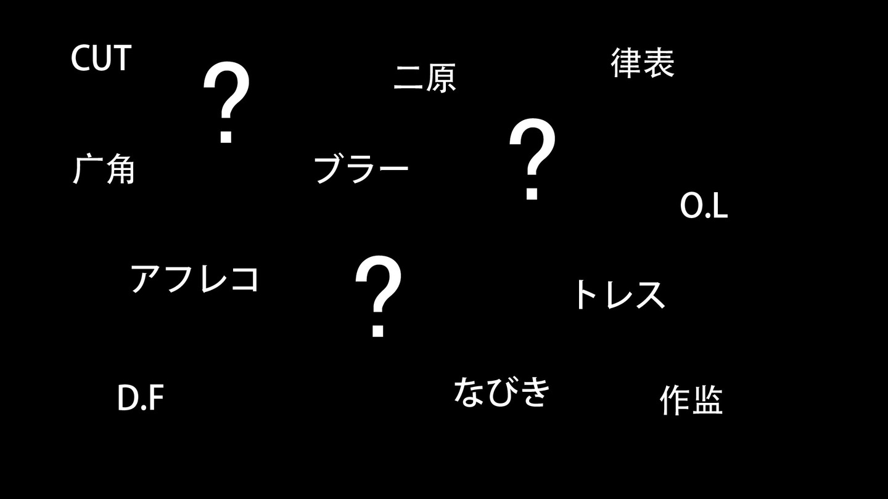

## 1. A.C
Action cut （アクションカット）的简称，即动作卡或者打斗卡。アクション作监就是专门负责动作卡的作画监督，简称AC作监。有时动画中动作的剪辑也被称为A.C。

## 2. BANK（バンク）
兼用卡。比如变身、绝招等等一部动画里反复使用的镜头。一般这样的镜头会专门拜托厉害的大手原画。某些地方叫DN（Duplication Negativefilm）。

## 3. BG
即背景。Background的简称。动画作业中是layout的后一步，背景部门根据layout画出要求的背景。然后摄影部分负责人物层和背景层的合成。

背景的具体工作： http://background-animation.com/background.html

## 4. BG only
只有背景或者只有背景和book，没有人物的镜头。交待时间地点时较多。

## 5. BOOK（ブック）
前景。比如下图右下角部分被模糊化的石头，比人物层还靠前但是是背景负责的部分。听说是早期摄影因为背景夹人物层的样子像书一样，于是叫书（book）。

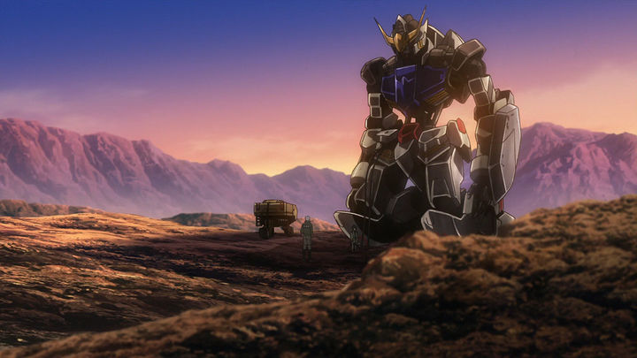
（截自《机动战士高达：铁血的奥尔芬斯》第二集）
 

## 6. Cast(キャスト)
演员表。即动画中的声优表。

## 7. Cut（カット）
即卡、镜头，电影中摄像机从开到关这个过程中拍摄到的片段为一卡，也可以叫一个镜头。动画制作中通常以卡为单位作业，例如“某原画师负责了某场景的10卡”、“还有3卡没有完成”、“某作画监督一天可以修20卡”。原画一般也以卡为单价结算工资。

## 8. DF（ディフュージョン・フィルター）
Diffusion Filter的缩写。摄影用滤镜使画面略微泛白泛糊，可以模仿光照、雾霭等等的效果。具体效果如何可以百度谷歌。

## 9. ED
Ending (エンディング)。正片结束后播放的音乐和影像，一般会载着声优和staff的名单。剧场动画一般是播放主题曲比较多。

## 10. F.I 和F.O
Fade in 和Fade out的简称，前者是淡入，影像从屏幕上慢慢出现；后者是淡出，影像从屏幕上逐渐消失。

## 11. Fix（フィックス）
静止镜头。非常普通常见的镜头，现在演出方式偏向于实拍的动画中用得很多。

## 12. Follow（フォロー）
跟镜头。摄影机移动使运动中的人物不移出画面外，可以靠拉动背景、不移动人物位置实现。

## 13. High light（ハイライト）
高光。动画中用靠近白色的颜色来表现，比较常见的是头发上的高光。作画时用红色的笔来描边、用黄色来涂色的情况较多。相反阴影部分用蓝色来描边较多。

## 14. high contrast（Hiコン、ハイコン）
高反差、高对比。强调光影的反差度，露光部分亮度增加，背光部分暗度增加。

## 15. NC（ノンクレ、ノンクレジット）
non-credit。参与了但是没有在制作成员名单里记名，比如铃木典光参与了原画但是没有记名，可以说是这集有NC典光。去掉制作成员名单的OP和ED，也被叫成NCOP和NCED。

## 16. O.L（overlap、オーバーラップ）
叠化。从一个画面逐渐变成另外一个画面。在各种电视电影动画中，作为转场技巧较多。

## 17. OP（オープニング）
Opening。相对ED一般放在正片之前，是一个作品的脸面，会投入较大的人力，一般能画OP的都是大手原画。

## 18. Pan（パン）
Panorama的简称，摇镜。在电影拍摄中，摄影机位置不动，仅仅改变方向。但是在动画中摄像机方向移动的概念比较模糊，画面上下左右的简单移动都能叫pan。比如展现角色时从脚部匀速移动到头部，单纯向上移动，具体一点可以叫pan up。

## 19. SE
Sound effect。效果音。比如角色受打击时，“duang”的一声，就是典型的SE。

## 20. S.L（スライディング）
sliding的缩写，滑动。背景层或者人物层相对的横向移动等等。

## 21. T.B和T.U
Truck back和Truck up的缩写。即拉镜头和推镜头。前者画面中的人物越来越小，后者越来越大。在动画中和zoom back和zoom up区别不明显，经常当一个处理。实际上T.B和T.U必然伴随密着S.L，因为随着镜头移动透视在变化，被拍摄物体在镜头中的相对位置会发生变化，zoom back和zoom up只是单纯的缩小和放大，这个可以自己想象体会区别。

## 22. あおり
从下往上拍摄出来的构图。比如湖川友謙的湖川あおり。

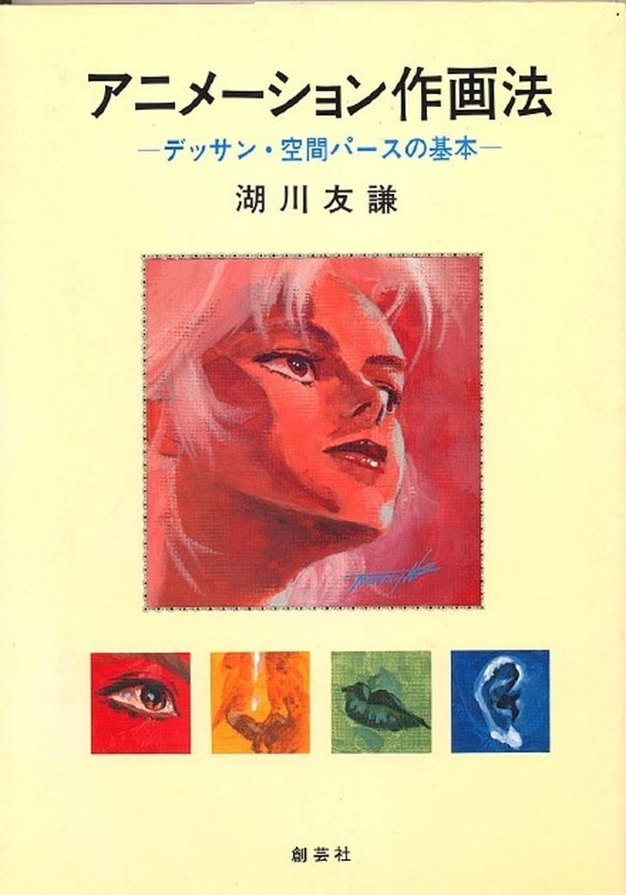

据说这个词是从仰向く（あおむく）变化而来。

## 23.  あたり
参考。可能是原画给动画的参考，比如怕动画摸不准中割位置，于是自己画了一个大致位置轮廓，这个大致的位置轮廓就是あたり。也可能是3D layout中人物建模给原画作画的位置参考。

## 24. アバン（avant）
指一集动画中op前的部分。op后到中间eyecatch和广告（国内一般都已经剪去广告）部分为A-part，之后到ED部分为B-part，ed后到预告前为C-part。C-part和アバン不一定有。

## 25. アフレコ
After Recording的简称，简写成AR。声优们参与录音的步骤，一般监督脚本演出都会参与。这个步骤画面大多数情况还没全部完成，声优可能对着分镜或者未上色原画（线摄）录音。

## 26. 絵コンテ
分镜。国内也可以叫台本。根据脚本把镜头的草图一格格画好，分配台词演技，标上时间。

## 27. 絵柄
作画要素之一，现在基本都用来指代“脸”。每个原画师因为本身作画的习惯，画出来个脸都和标准有差异（人物设计），作画监督的工作之一就是统一脸，把脸修过来，专业点来说就是统一绘柄。

其实绘柄不单单只是脸，过去也指代线、身形等等，因为原画的个性也会体现在这些方面。一般接近人物设计评价越高，绘柄不统一直接会给观众造成崩的印象。

## 28. エフェクト（effect）
特效。用动画表现的火、水、风、烟、爆炸、闪电等自然物，现在用3D来做的情况也有。和日语中摄影后期的“特殊效果”（特殊効果、特効）是完全不同的东西，请注意区别。在中文中好像是在通用，但是说的可能不是同一种的东西。

## 29. 演出
根据分镜指挥各个部门做成连续的动画片段，同时参加当集各个环节的会议，解决各个人员和部门的衔接问题，相当与单集的导演。打个比方，分镜是乐谱、演出就是指挥、原画就是乐队。

## 30. 原画
作画中的关键帧，也可以称画原画的人。

厉害原画师对时间、动作、变化的控制，或者说他们对于画面本身的表达就有观赏和研究的价值。

## 31. 一原
第一原画的简称。即草原画（ラフ原，rough 原画），一般只有演技动作，人物的服装、表情、细节等等都没有细化。最近和layout一起作业的情况比较多，某些时候说的layout就包括了一原。一原也可以指画第一原画的人。

一原、二原、动画、上色后成品的分别演示：http://weibo.com/2250332391/CELKhojzH （国内不同动画公司之间标准不统一，可能会有差异。）

## 32. 二原
第二原画的简称。把一原细化成可以用于动画中割的原画。二原也可以指画第二原画的人。

## 33. 原撮
原画摄影的简称。把原画不经过上色背景合成直接按照律表做成动态效果。一般AR用。视频：[《一拳超人》官网公布的原摄](https://link.zhihu.com/?target=http%3A//cdn.animetamashi.cn/94739724b403e4a8/video/adf038)。

直接用分镜这样做即是分镜摄（絵コンテ撮），画面基本不会动。分镜摄和原摄可以统称为线摄。另外经过动画描线和上色再按律表时间做成动的画面，但是还没有和背景合成，叫作タイミング撮（timing摄）：http://weibo.com/3802497414/D1h0jsgOC

## 34. 一人原画
由单独一个原画完成一个OP、ED或者整集，称这个是一人原画OP、一人原画ED或者一人原画回。因为靠一人完成一集的原画任务是非常需要时间的，所以一人原画一般是非常早期就是开始规划、有预谋的一次行动，绝不是预算不足或者工期紧张。一般一人原画的原画师都是大手原画师，作画质量会比较高。比如排球第二季第四集的高桥英树一人原画。

## 35. ダビング
dubbing，简称DB。根据影像把AR时录的音、效果音、背景音乐加上。

## 36. 動画（动画）
这里特指片尾制作人员表中的動画。负责把原画描成可以上色的线，因为原画的线无法直接上色（所以原画的画都不是我们看到的画）。此外动画还需要根据原画加中间帧（中割），使动作看起来更加流畅连贯。

关于具体作画流程，推荐阅读：listeningside sideA

## 37. 動画チェック
动画检查，简称动检。正如字面意思检查动画、保证动画质量的职位。

## 38. デザイン（design）
设计。负责画面中出现的各种人物道具、妖怪、服装、武器等等的设计。在OP里会表记为各种各样的某某某デザイン。比如人物角色设计：キャラクターデザイン（character desige）；机械设计：メカニックデザイン、メカデザイン或メカニカルデザイン（mechanical design）；武器设计：武器デザイン；道具设计：プロップデザイン（prop design）等等。

## 39. 原案
初期设定，或者早期的故事大纲。漫改的漫画师、轻小说改的插画师一般会担当人物设计原案（キャラクター原案），由动画的人物设计（キャラクターデザイン）改成适合动画作画的动画用人物设计，这个过程可能会对原案人物设计进行大改。人物设计师也可能分为两大类，还原系和风格系，前者会尽量还原原案风格，比如谷口淳一郎、佐野惠一、石野聪等等，后者会修改成自己风格的人物设计，比如足立慎吾、川上哲也、渡边明夫等等。

## 40. トレス
描。一般指把原画描成动画这个过程。

## 41. 同トレス
同描，简称同T。就是把一张画一模一样描一遍，或者部分一模一样描一遍。多张同描重叠会造成线条的抖动，所以如口型卡（口パク，人物不动光说话的镜头），多使用合成，即人物本身只描一张，嘴巴画多张，后期合成上，这样也能节省人力。

## 42. 止め
不动静止的画。主要指一连串打斗动作中突然插进的一个不动的特写镜头，大多是说话的镜头，口型卡。

## 43. グロス（Gross）請け
相对与统包（元请）的外包。A动画公司规模有限，无法承担整季动画的制作，于是分12集里面的3集给B动画公司，那么B动画公司必须负责这3集动画的全部制作，那么这3集可以叫グロス回（外包回），A公司是元请，B公司是下请。一般外包回在片尾可以看到协力、アニメーション制作协力、协力制作等等。（注意必须是在制作进行、制作desk的那页。）

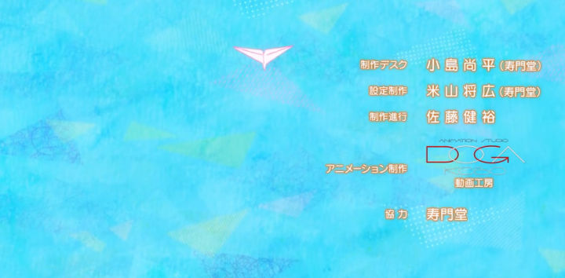
有单独作画部分全部包出去即作画外包（作画グロス）、单独上色全部包出去即上色外包（仕上げグロス）等等的各种情况。

## 44. メインアニメーター(Main animator)
主要原画师。一般是整个作画团队中除了总作监出力最大的原画师，可能是负责重要集数的修正，或者负责重要场景的原画，具体不一定。在某些作品中会叫キーアニメーター（key animator），偏向于画重要部分、重要场景的原画，比如bank，最终决战，关键部分演技等等，但是key animator在英语中是原画师的意思，注意区分。

## 45. 中なし
中空、中无。一个pose到另一个pose之间不加中割，金田流作画中用得很多。在跃动感较强的作画中经常能看到。

## 46. なびき
nabiki。表现风吹头发、旗、衣服等等的飘动，一般是几张画重复播放。算是特效中的一种。《K》第二季第一集开头天台部分就有大量的なびき。

## 47. タイムシート(Time sheet)
律表。作画的时间表。确定每张画的时间、镜头效果、台词等等指示表。在作画过程中非常重要。

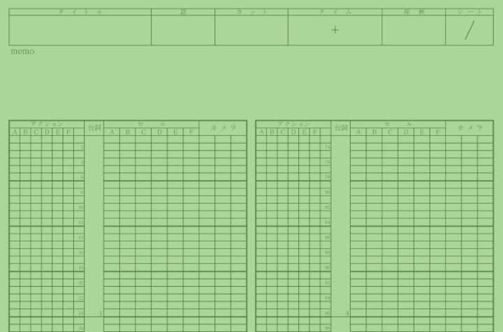

每一行都是1/24秒，每一格都可以对应一张画。

实际被填写律表的一部分：

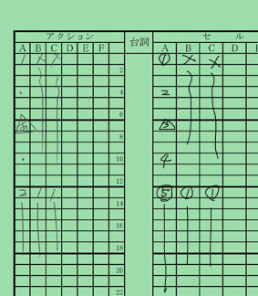

左边是アクション栏是原画填写的，右边セル栏是动画填写，一般都是动画的セル栏填写都是根据原画的アクション栏。ABCDEF为分层，比如脸部为A层，嘴巴为B层，A层完全静止，B层重复闭口、半开口、开口三张，就能做出人物说话的效果，口型卡中经常用到的合成手法。

每一格虽然都能对应一张画，但是每格填满的情况极少，上面示例的部分是三格一张画，一张画在画面中停留3/24秒，就是一拍三，日语中叫三コマ（koma），同理两格是一拍二，二コマ（koma），操作中有时简称成k，1k就是1コマ。

另外注意并不是作画张数越多越好的，1k的作画效果有时不如2k，大动作中的过高张数不会增加画面的流畅度。同时当原画师有较高技术，造型非常好得体现运动趋势且关键帧的位置挑选准确的话，3k4k的效果都能比1k2k的效果更加流畅。高张数的效果不一定比低张数的效果好。

所以说画面流畅不一定是帧数高，帧数高了也不一样流畅，有时候会出现扭来扭去的不适感，低质量的中割更是会降低画面质量。以帧数标榜画面质量是非常典型的小白行为。

## 48. ブラー（blur）
动态模糊。为了表示物体的高速运动物体、动作、爆炸等等，适当添加动态模糊，现在大多数动画里都能看到。画面糊了不一定是制作组想偷懒，只是为了效果更好故意把画面做模糊。

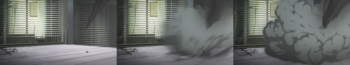

这里需要区别一下残影，视频压制处理不当容易出现残影，和后期有意加上去的模糊是完全两种东西。视频网站在线观看经常能看到残影。这是非常不该犯的低级错误。

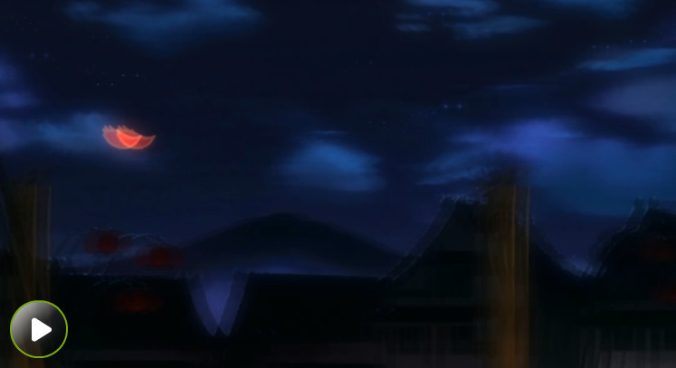

## 49. ボケ
背景模糊，Depth of Field。这个更多表现看近处，远处景物变糊的失焦模糊。同样看远处，近处也会失焦模糊。

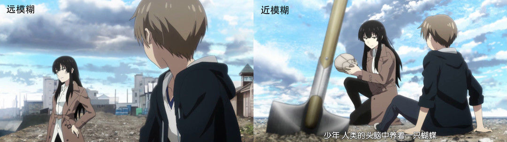

此外上期说过的DF（Diffusion Filter）加过重也会出现模糊的效果，这种过糊在国产动画中比较常见。原理比较接近于美颜软件加过重丢失细节。和上面的ボケ不同。

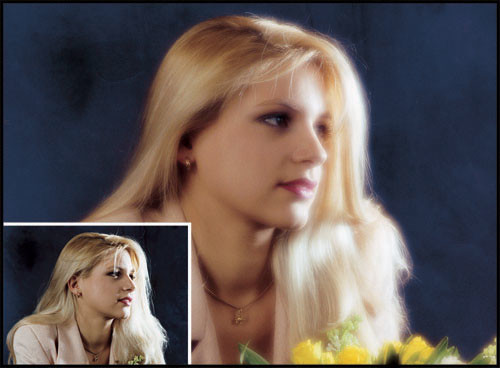

## 50. ブレ
抖。人物不做动作的小抖动、振动。一般同描两张或者三张，反复播放就能表现出抖动效果，同トレブレ。另外还有手ブレ，模仿手持摄像机的镜头抖动，模仿实拍效果，需要摄影后期添加效果。

## 51. 仕上げ
上色。和动画合称为动仕（動仕）。中国外包部分主要都是动仕，日本本土来说这些都是海外动仕，绝大多数时候质量是不如社内动仕的。

## 52. 撮影
负责把上色完成后的作画层和背景层合成在一起，按照律表排列时间，加上必要的后期效果。最早的需要在摄影台上做合成作业，所以叫摄影。

具体摄影词汇可以看：http://m.anitama.cn/article/5211f3bcc862da6f

## 53. リテーク（re-take）
返修。检查不合格或者没有达到要求，打回重做。可能是作画的重做，也可能是颜色、背景、摄影等等。

## 54. 背流
流线背景的简称。一般是为了表现人物移动太快，背景跟不上人物效果；或者表现人物惊讶、开心时配合效果音出现的背景特效。

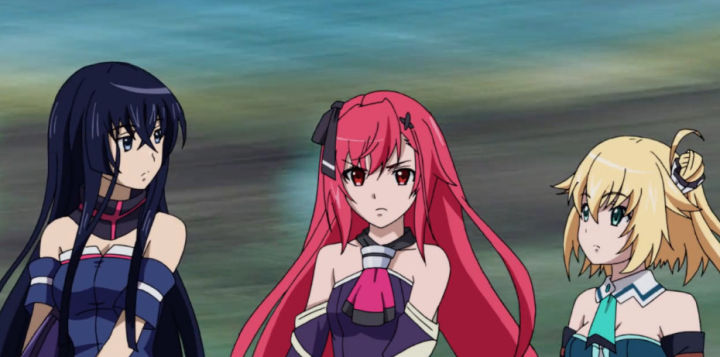
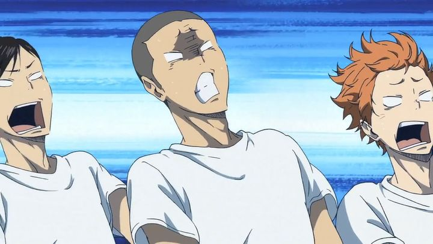

## 55. レイアウト（Layout）
设计稿，简称L/O，也叫构图。根据分镜，配置一个镜头的人物和景物，决定镜头效果、光影等等，一般由原画来负责。Layout完成之后才能进行原画作业。因为分镜一般非常草，场景都没有细化，所以配制画面的layout步骤非常重要，一般情况监督会检查所有layout。

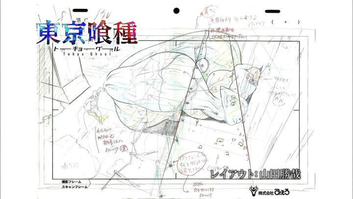
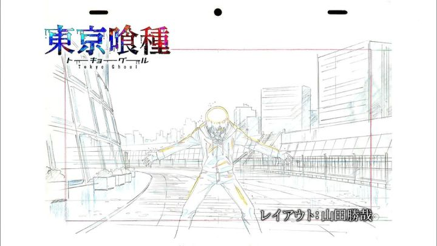

## 56. ラッシュチェック（Rush check）
早期赛璐珞时代流传下来的用语，指把摄影处理完的影像检查一遍。细分为バラチェック（bara check）和オールラッシュ（All rush），前者是一卡一卡单独分散着检查，后者是把所有的卡都连接在一起检查。以此来决定retake的内容。

## 57. ワイプ（wipe）
划变。一个画面沿着一个轮廓变成另外一个画面，像笔划过去一样。

## 58. ツメ指示
轨目指示。原画给动画的指示，用来参考中割的位置，通过轨目可以实现加速减速的效果。

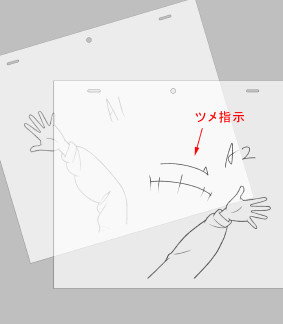

59: 望远镜头 和 广角镜头
在用相机拍照时可以通过换不同的镜头来实现拍出望远、广角的效果。

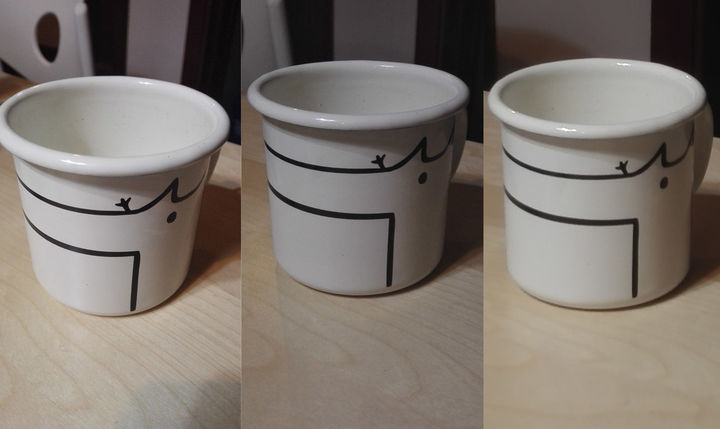

杯子在画面中同样大小，左边是广角效果，右边是望远效果。广角的背景范围最大，杯口中心被放大；望远背景范围最小，但是还原了杯子最真实的情况。上图并不是通过换镜头来实现的，如果知道原理的话，不需要换镜头就能实现部分效果。

广角镜头是比标准焦距短的镜头，会造成背景的范围更大，但是影像中的物体更加有疏离感。

广角特写就经常用于表现人物的不安紧张的情绪：

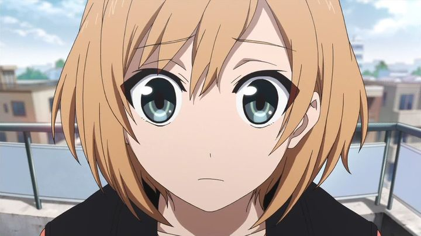

当广角镜头焦距短到一定程度，就会出现似乎扭曲空间的超广角镜头，甚至鱼眼镜头：

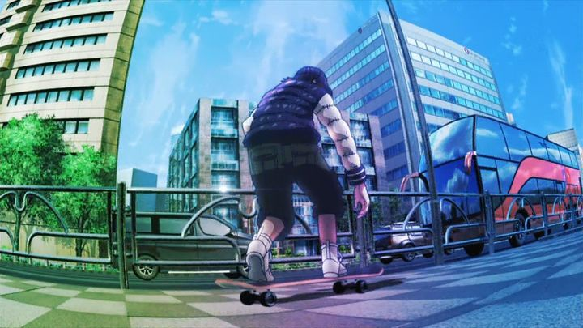

望远又可以叫做长焦、远摄。我们通过望远镜里面看到的画面就是望远镜头，望远镜头和广角镜头相反，中心物体靠得更加紧密，一般电影出现这类镜头都是强调客观，或者窥视感。在动画中单纯出现的情况比较少，对layout的要求非常高，不靠参考单纯画出物体在远处的感觉是非常困难的。

下面是一组望远镜头的运用，《一拳超人》第三集阿修罗独角虫被吓到退到墙壁旁，上一张是一个大广角，下一张就是望远了，在下一张中大家应该能感受到拍摄阿修罗独角虫的机位是离阿修罗独角虫较远的，有点像琦玉老师在远处望过去的感觉。这卡用望远是强调阿修罗独角虫后退的距离感，表现害怕。

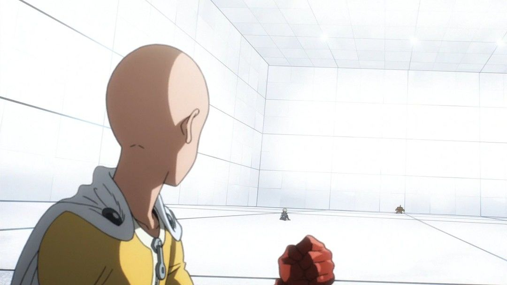
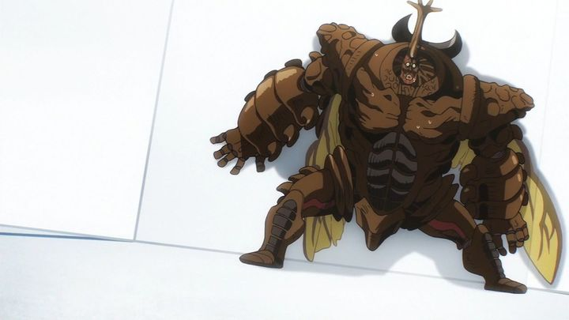

下面这个图就是利用前景地面遮挡做出望远感，让观众意识到机位较阿修罗独角虫较远。这个望远是从视觉上放大阿修罗独角虫，强调阿修罗独角虫的强大。

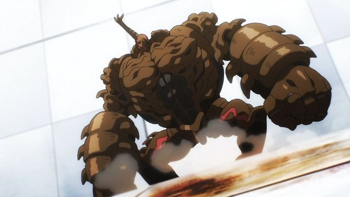

对于这两种镜头效果的分辨，需要结合机位与目标物的距离以及摄像机拍摄到的范围。单独一项是无法判断是广角还是望远的。

## 60. 监督
决定作品总体方向和构成的人，是制作现场最重要的人。现在经常是担任第一集的分镜演出，作为其他分镜演出的标杆。理论上啥都得管，但是由于时间问题往往只能掐一些关键点。比如LO检查、All rush提出retake等等。

## 61. 作画监督
简称作监。动画作画部分的负责人。单集的作画监督负责当集，总作画监督需要负责整个作品。

作监的基本任务是修正原画，提高整体作画水平，虽说是修正但不是橡皮擦，而是盖上修正用纸把需要修改的线重新画一遍。因为作画流程是layout→原画，所以细分可以分为layout作监和原画作监。

现在由于工期压缩、原画质量普遍下降，作监全修的情况原来越多，作监的任务也越来越重，出现很多一集有大量作监的情况。

也因为不同的作画监督本身的个性和擅长方面不同，很多动画有特别设置比如人物作监（キャラクター作監）、机械作监（メカニック作監）、特效作监（エフェクト作監）、道具作监（プロップ作監）等等，来管理具体部分的作画。

## 62. 作画崩壊
一般来说是难看的、不忍直视的的作画。由作画失误、作画者水平低或者工期太赶，作业时间不够造成各种画面问题，比如整个片绘柄不统一、脱离原人物设计、人物身形不统一、构图透视错误等等。远景简化人设不能算作画崩坏。

现在普遍大众用崩来指代画面难看的情况比较多了。

## 63. 制作進行
制作进行，执行制作。动画中做各个部门之间的传达、交接、联系等等苦力。统筹管理制作进行们的就是制作デスク（制作desk）。

## 64. 制作、製作
日文里的制作和製作有不同的含义。制作为动词，相当于英文里的“make”，比如动画制作、制作协力；“製作”是英文里的“production”，包含企划、负责和资金调配，比如製作委员会，製作委员会是不直接参与动画制作的。请注意区别。

## 65. 制作、製作編集
编集，又可以叫カッティング（cutting），简称CT。按照分镜把每个镜头串联起来，根据需要的演出效果调整镜头和时间，并做成符合电视台播放的时间长度。理论上编集应该放在镜头全部完成之后，但是现在因为工期越来越紧，分镜直接进行编集确定长度的情况并不少见，分镜的内容都是非常粗糙，这样提前编集的效果肯定不会好，每个镜头之间的衔接多多少少会出现无法避免的问题，只能在后期慢慢磨合解决。

所以现在多把编集分为オフライン編集（offline编集）和オンライン編集（online编集），前者就是直接做分镜摄，提前于作画的编集；后者就是上色摄影完成之后的成片编集。

推荐阅读：https://www.imagica.com/column/cat21/post-27.php

## 66. V編
video编集的简称，加上片尾制作人员表，做成能直接在电视上播放的视频，是流程的最后一步。