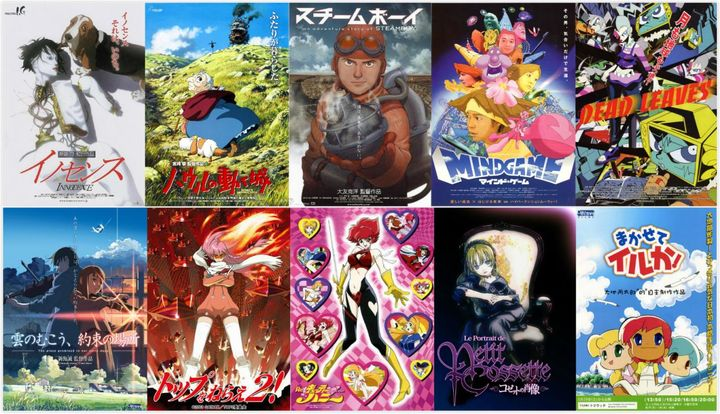

>2004年是日本独立动画的大年。  
光是在剧场版动画方面，就有在戛纳电影节大放异彩的《攻壳机动队2：无罪》（イノセンス）；因《幽灵公主》（もののけ姫，1997）《千与千寻》（千と千尋の神隠し，2001）备受世界瞩目的宫崎骏推出了新作《哈尔的移动城堡》（ハウルの動く城）；初次监督的汤浅政明则以《心灵游戏》（マインド・ゲーム）向世界展示了一种截然不同的动画表现方式；阔别多年的大友克洋推出了他第二部监督作《蒸汽男孩》（スチームボーイ）；因《星之声》（ほしのこえ）响彻动画业界的动画作者新海诚推出了更高制作水准的《云之彼端，约定的地方》（雲のむこう、約束の場所）……这当然不得不提，出身“宅社”GAINAX公司的今石洋之在Production I.G完成了他的监督首秀《落叶》（DEAD LEAVES），并与OVA《飞跃巅峰2》（トップをねらえ2!）《Re: 甜心战士》（Re:キューティーハニー）两部同出自GAINAX人之手的明星立于大地之上。

<!-- 

2004年带有独立作者色彩的动画

 -->
::: img 2004年带有独立作者色彩的动画

:::

>2019年，今石洋之监督的剧场版动画《PROMARE》（プロメア）大受欢迎。与15年前的环境相似的是，这一年同样是独立剧场版动画爆发之年——这很可能是因为新海诚的《你的名字。》（君の名は。，2016）大热而引发的剧场版动画企划热潮（一般来说剧场版动画三年或以上的创作周期是常态），且这些作品大多数同样带有作者色彩。文化研究学者土居伸彰在近日就如此评论过这十年来的日本动画（尤其是电影）：“这十年来，我一直密切关注着国际动画界的变化。当我以一种旁观者的视角观察日本动画时，总觉得他们散发着一种独立电影的味道。像许多欧洲动画一样，努力对抗着迪士尼皮克斯作品的商业气息，在日本动画里，能够找得到他们独特的风格和色彩。”①
今石洋之自然也是耀眼的动画作者之一，站在21世纪10年代末，《PROMARE》既总结了今石的作品，某种意义上也触及了日本动画的历史与动画本身。

<!-- 

 -->

## “新瓶装旧酒”的高手
——这是我对今石洋之监督的评价。

在我看来，今石包括他带领的Trigger（动画公司）团队都是这方面的高手，而这也是Trigger作品**拥有高度统一和高辨识度的个性，让公司本身形成品牌效应**如此特征的原因之一（通俗一点说便是作品和公司容易“出圈”），同样有这样特征的，除了以前的GAINAX、ufotable、P.A.WORKS、吉卜力等之外，还有就是京都动画。

Trigger走是路人和核心观众都能获得快乐的路线：在选取题材和独特趣味的释放上，Trigger一直是好手，路人观众能收获朴素的观看乐趣，并成为作品和公司的粉丝；核心观众，又或者说是被称为“御宅族”的Hobby核心爱好者，这些人能在Trigger的作品中寻找那些被人忘却的亚文化，比如《KILL la KILL》（2013）中暗藏了1985年的特摄剧《飞女刑事》（スケバン刑事）的彩蛋，其中多次出现的“破廉耻”这些过时的台词配合情节又能让人想起永井豪的下流漫画。在《PROMARE》中，湖底的研究所则neta了《魔神Z》（マジンガーZ，1972）里的“光子力学研究所”，片中的湖底渐渐拉开，水顺着被拉开的湖底产生了瀑布，巨大人型兵器从中出击时的画面又与魔神Z的出击方式如出一辙；更别说那经典的双手抱胸的经典姿势“GAINAX立”。Trigger对各种各样只有核心爱好者知晓的“秘密”套以新瓶对外“展示”，或许也因此，Trigger的作品总能给大众以新鲜感。

<!-- 

“GAINAX立”的传承

 -->

这种彩蛋的填充是当下流行文化作品创作一大潮流，好莱坞有《头号玩家》（Ready Player One，2018）《无敌破坏王》（Wreck-It Ralp，2012）以及漫威与DC电影，日本动画则有《POP TEAM EPIC》（2018）《SSSS.古利特》（SSSS.GRIDMAN，2018）等。通过彩蛋，部分观众能获得故事额外延伸的乐趣，获得与创作者独特共鸣的满足感。这类“梗作品”也通过吸取前人的创作，赋以新瓶呈现在世人面前，让新老观众都获得乐趣，取得平衡的共赢。

当然，《PROMARE》中的“彩蛋”并非止步于此。正如当年《落叶》是今石恶趣味的百分百的体现，《PROMARE》作为今石阔别多年的原创剧场版动画，也是今石创作生涯的阶段性总结，自然会带有过去作品的影子。而在本作担任人物设计的小山重人也承认，他们在把《落叶》当作创作《PROMARE》的“假想敌”②，这种创作原点为《PROMARE》渲上更为浓厚的意义。

## 从字幕演出说起
了解GAINAX的人都应该知道，GAINAX动画一大特点是关于字幕的演出。即使如今GAINAX已经名存实亡，很多从该公司出走的创作者们都延续了这一风格，比如锦织敦史就同样也在其“大作”《DARLING in the FRANXX》（2018）运用字幕展现片中出现的机体机器的型号或名字，这也是GAINAX动画最经典的字幕用法。今石同样也是这一风格的被影响者，《PROMARE》中就出现多幕以粗矿的英文字体配合狂放的手写日文的“字幕卡（Cut）”，笔者认为这同样也是“新瓶装旧酒”的表现，换个说法，就是“传承”。然而今石对字幕演出的效果又与庵野秀明这些前辈们有所不同。

<!-- 

《DARLING in the FRANXX》中的字幕演出

 -->

作为使用字幕演出最出名的庵野曾经坦言，自己的字幕演出风格受到了东宝战争电影和冈本喜八监督的影响。他认为，文字（话语）作为一种记号，容易置换观者的感官印象（イメージ）。 因为影像本身时很复杂的，所以容易让人产生误解的范围很大。若影像创作者想要加大控制观众理解影像的力度，向观众传达自己的信息时，最好也最简单的便是文字媒体。而像是小说这种用文字构成的媒介，把握好文字换行分段的时机，读起来会让人感受到其独特的韵律与节奏感并产生美感。③

<!-- 

东宝出品、冈本喜八监督的战争电影《血战冲绳岛》中的字幕演出，这部电影也受到了庵野秀明的喜爱，以至于在《新·哥斯拉》中冈本喜八以照片的形式客串了一个虚构人物登场

 -->

除此之外，他还认为在影像中，字幕一旦出现，情报量就会大大增加，动画尤其如此，会给动画绘制的画面赋予力量，也让观众的视点一下子聚焦在上面。③

因此，在这种方法论之下做出来的作品，庵野秀明的字幕演出既为了纠正视觉方面的平衡感，也提高了传达信息的效率。稍加观察就会发现，庵野的字幕大多数用于定场、时间、特殊名词标注，而庵野的心水监督冈本喜八同样也如此使用字幕，并且让现实主义的电影带有记录色彩。而《新世纪福音战士》（新世紀エヴァンゲリオン，1995）的第25话中，字幕卡的插入有描写了碇真嗣的心象风景，文字捋清了过于凌乱的内心叙事，让观众直观地了解到真嗣的心情，也让有的观众与真嗣共情共鸣。这些都是庵野字幕演出方法论的体现。可以说锦织是在庵野这条延长线上的。

<!-- 

《新世纪福音战士》第25话开头的几cut镜头，顺序为从左到右从上到下

 -->

今石偏爱由深作欣二监督的电影《无仁义之战》（仁義なき戦い，1973）④，这部电影最大的特征同样利用字幕演出传达信息，为本来就是改编自真实黑帮事件的故事与影像赋予记录的客观性，从而转化成真实感。这种用法似乎和冈本、庵野等人的字幕演出有着异曲同工之处。那么，作为GAINAX出身的今石是完全照搬照抄吗？非也。

## 意味なし（没有意义）
在此，必须要明确指出《PROMARE》的短板是剧本。

脚本家中岛一基与今石合作的三部原创动画（其余两部是《天元突破 红莲螺岩》和《KILL la KILL》）都将主角设置成处于作品世界中底层的社会角色，给予他们足够的空间向上反抗，与之对应的，他还会设置一个从故事开始就俯瞰主角的角色，比如《天元突破》（天元突破グレンラガン，2007）的罗杰罗姆，《KILL la KILL》的鬼龙院皋月。在不断突破社会上层的同时，主角往往会发现天外有天，以及发现曾经俯瞰自己的居高位者不过也是仰望着另一个上层的底层角色。在《PROMARE》中，作为Galo敬畏的父辈又是敌人的Kray，Galo在故事后半也发现Kray之上还有无法违背的“规矩”存在，那便是平行宇宙“PROMARE”中的神秘意识，这种高次元的意识拥有摧毁地球的能量。

<!-- 

鬼龙院皋月对着自己的母亲怒吼：“本能寺学园就是我为了打倒你而设立的堡垒！”

 -->

中岛一基通过这种人外有人天外有天的世界观设定来呈现故事的层次感，这种模式有点像是《魔神英雄传》（魔神英雄伝ワタル，1988）《魔动王》（魔動王グランゾート，1989）这种向上打怪的故事模式，只不过中岛一基的故事矛盾往往是一种寓言化的阶级矛盾（《天元突破》中将故事最终极的矛盾双方粗暴地命名为“螺旋族”和“反螺旋族”这一策略，可见主创并不打算为这个故事世界赋予详细的真实。）。这种寓言化之上，从头到尾矛盾冲突与解决都相当粗暴：主角遇事不决，气势解决，“××什么的，××什么的我不管！”——这种天真的台词更是中岛笔下人物的决胜句式，因此中岛与今石合作的动画中，支撑起武戏的往往是中岛赋予舞台剧感的文戏（中岛的本职是舞台剧本家）。寓言化加上天真的处事之道结果便是“一根筋”，尤其是《PROMARE》的故事层次与前两部今石×中岛动画相当，篇幅却大大压缩，叙事节奏大大提升的情况下，剧本的叙事结构几乎从头到尾都让故事的情绪处于一种释放的状态，这相当于整个剧本都处于高潮而缺乏戏剧起伏。

某种意义上，就连影像本身都保持着“不淡定”的状态。该片令笔者印象深刻的一个文戏是Kray首次向Galo坦白自己的行动方针时，他们乘坐电梯时对谈的那一段文戏并非使用常规的正反打镜头来拍摄，而是随着电梯的多方位移动，以大远景镜头随着电梯在由线条与几何图形构造的立体场景间穿梭游移，这种演出最大的意图在于为了不让画面安定下来，让观众的视觉感官有一丝无聊。

若说《天元突破》和《KILL la KILL》还具备一定的寓言意义的话（尤其是这两部TV动画前半部分的单元剧环节丰富了寓意），那么《PROMARE》则因过度浓缩的寓言与过度饱满的内容信息，削平了故事的层次，也让寓意挥发稀释。这部作品全方位地释放着“意味なし”（没有意义）的气息，只需要让观众满足感官刺激就行了。**简单来说，就是——爽**。

这种削平似乎是有意为之的，宛如本作扁平化的美术设计就是此意图的展现形式。这种扁平化的设计，今石说是从《吊带袜天使》（Panty & Stocking with Garterbelt，2010）开始的，这无疑是受到了极简风格的欧美动画的影响。而另一渊源，相信是今石的动画原点——金田伊功所影响。

<!-- 

对景深进行压缩的扁平化处理

 -->

金田伊功是日本动画界的革命家，他革新了日本的有限动画的表现形式。金田伊功将一些运动的规律与现象高度概括，并将之在空间与时间上符号化。其中，空间上，可以发现与其还原事物本身的姿态，不如利用夸张的造型变形与大胆的色块展现。其中，在色块上，作为金田第一批簇拥者的山下将仁更为极端，也发展出了“BL影”（动画中的大色块黑影）的独特运用方式，今石的风格同样可见山下的影响；而时间上，则展现为多个大幅度的Pose组合而成的夸张运动，并且对动的时机作精准踩点。

<!-- 

“金田光束”（金田ビーム）

 -->

当然，如今今石早已经与经典“金田流”渐行渐远，但他作品中展现的审美，包括这种结合欧美动画的扁平化趋势，金田对他的影响依旧有迹可循。《PROMARE》作为他全力踩尽油门的作品，笔者认为，故事与风格的双重扁平在有意无意中获得了统一，包括前文所述的为感官刺激服务的镜头调度，叙述结构的平直，寓意的削平，都指向了“意味なし”本身——当然，前文留得悬念，字幕演出同样如此。

今石在监督处女作《落叶》中就有过许多字幕演出，不过大多数都是模仿漫画符号出现的音效文字（比如《JOJO的奇妙冒险》TV系列中就保留了漫画里的音效文字）。这得益于日语本身就有许多可充当拟音·拟态而使用的词语，这也丰富了日本漫画的表现手法，拟音·拟态词早已经成了日本漫画的符号之一。动画出现这种拟音·拟态词是动画对漫画文法的挪用。

<!-- 

《落叶》画面中出现的拟音·拟态词

 -->

今石动画的漫画演出学习自《FLCL》（2001）的监督鹤卷和哉，鹤卷让今石了解到漫画独特的文法若搬到动画中会产生独特的氛围。因为拟音·拟态词是感觉性词汇，日本漫画研究者夏目房之介认为，这一类词在漫画中既是文字同时也是绘画⑤，让本身只有视觉（空间）的漫画赋予了带有时间的听觉（描绘声音的文字会呈现一定长度的时间）。而对于本来就拥有时间的动画媒介来说，这种拟音·拟态词漫符的出现，让视觉的刺激通过具象化的听觉倍增。不仅是今石，就连宫崎骏也在吉卜力美术馆上映的短篇动画《寻找家园》（やどさがし，2006），也将拟音·拟态词“写”进了画面中，同时片中音效全部采用人声配音，通过独特的日语拟音·拟态文化，角色对周遭世界的感觉通过文字的具象化呈现给观众（此处也对应了庵野认为文字是一种直白的记号的观点），也让日本人的生活体验返璞归真。

<!-- 

《寻找家园》

 -->

今石同样也在利用文字呈现感觉。作为漫符的文字自然如此，而另一方面，他也利用字幕演出呈现一种图形的奇观：《天元突破》中的毛笔字演出，《KILL la KILL》中由字体公司Fontworks 推出的专属字体“KILL la KILL OFFICIAL FONT PACKAGE”的字幕演出，到《PROMARE》，画面中的文字组建失去了原本的叙述意义。也就是说，这些机体名字如何这些招式名称叫啥，本身并不是重点，关键的是文字作为符号在视觉上的呈现效果，尤其是后两部作品，可谓名副其实的字幕奇观，至于文字（话语）传达的信息，早已经不重要了。相比之下，《落叶》的演出更具备经典金田流风格与漫画演出的结合，其拟音·拟态词文字演出既来自于漫画，又和今石如今的《PROMARE》的字幕演出异曲同工，皆为了增加纯粹的感官刺激、将文字特有的节奏感化作视觉、强化视觉作用而存在。某种意义上，不具备意义的《PROMARE》是对同样不具备意义的《落叶》的回归。

在《PROMARE》中我们可以见到熟悉的机器人，熟悉的GAINAX立，熟悉的字幕演出，面目全非的“金田流”，但今石早已经为它们装上了“没有意义”的新瓶，是忽略逻辑过程的感觉先行。

<!-- 

《PROMARE》化为视觉奇观的字幕演出

 -->

《PROMARE》的大红大紫很大原因是因为女性消费者的狂热，Galo和Lio两人是敌是友若即若离的微妙关系，让本作产生了大量触及“YAOI”同人文化的二次创作。而YAOI这个如今充当“耽美”的代名词，其词源恰恰是「やまなし、おちなし、いみなし」（没有高潮，没有收尾，没有意义）的缩写。

## 灵魂力量
有意思的是，在《PROMARE》中，呈现火这种自然现象的几何图形是三角形，然而在Galo居住的新首都中心区，就连太阳光在镜头下呈现的光斑，都采用了与城市中高楼大厦对应的矩形来展现。矩形意味着方正，意味着规矩，具备锐角的三角形无疑更具有攻击性，这也和火的属性相似。

<!-- 

注意一下这些正方形的光斑

  -->

对于《PROMARE》出现的火焰，今石认为火焰就是动画的本质，是一个接近原点的东西。“这正是动画的语源‘anima（灵魂）’。”（中岛语）⑥

我们如今熟知的animation这个英文单词，正是源自拉丁文中的“anima”，也就是灵魂之意，其动词animate的意思是——赋予灵魂。这种远古的渊源让动画这门艺术本身赋予了这种独特的意义。Trigger这个团队对动画的理解恰恰是如此古典朴素，在《小魔女学院》（リトルウィッチアカデミア ，2017）的ED第一个画面中，便是展现了难以用词语概括的动画形变，时而液体，时而光，时而几何，时而无规矩……这些形变最终变成了一团火焰，这短短几秒恰是在证明了动画（灵魂）的力量，证明这股力量的可能性。

今石和他的Trigger依旧在寻求动画的可能性。

<!-- 

《小魔女学院》ED

  -->

土居伸彰说：“现在不是‘生命的幻象’（形容迪士尼动画），而是‘生命的寻觅’的时代了。岩井泽健治的《音乐》（2020）也好，久野遥子的作品也好，制作长篇的时候，会使用动作捕捉、转描这些技术的独立创作者变多了。你要是问他们这样做的理由，他们会说想要让作品变得更加丰富。引入一些在自己想象力之外的、异质的东西，和这些搞不太懂的东西通过‘对峙’获得喜悦，我觉得这对于今后的动画来说越来越重要。”⑦

在《PROMARE》中，今石对使用3DCG与手绘的结合已经登峰造极，两种动画制作方式成为了创作作品的工具之一，只要能展现出理想的影像，都可以大胆使用。这恰如当时庵野采用实拍影像弥补动画媒介的不足，可谓“不管黑猫白猫，抓到老鼠的就是好猫”。正如他所说，现代的动画中，“2D风格的3D”为卖点的时代已经结束，接下来是以最终输出的影像成品本身的质量来决胜负的时代。⑥从此可见，土居伸彰的评论相当一针见血。同样的，经典金田流在今石手里早已面目全非，但你却能在《PROMARE》找到与金田流殊途同归的表现方式。

宫崎骏在2005年度国际交流基金会上曾经发表过如此演讲：

    *‘对灵魂而言何者最重要呢？’

    ‘灵魂是什么？’

    我想，这正是我们永远不变的主题，也是我们被赋予的课题。

    尽可能不隐藏、不露骨、不大声张扬，在欢声和平静之中把它表现出来，这是我们现在的课题。⑧*

金田在《幻魔大战》（1983）里绘制的由火焰组成的龙，也就是“金田龙”，早已经成为日本动画耿耿星河上一束耀眼的灵魂高光。如今，《PROMARE》再次将火焰与动画的关联抬到世人面前，在这个日本独立剧场版动画爆发的时间线。毋论《PROMARE》是否需要存在意义的意义，毋论该作评价如何，《PROMARE》的独立性确实触及到了动画的核心——即使是以御宅族创作者最擅长的戏仿（parody）这种方式。

    注释与参考
    ①豆瓣网友gansen译，【翻译】2010年代的动画巡礼：从日本到世界——土居伸彰×高濑康司×石冈良治座谈会（上）
    ，译文地址：https://www.douban.com/note/751880160/，豆瓣，原文出自： 『美術手帖』2020年2月号特集「アニメーションの創造力」，题目：「2010年代、日本アニメから眺める世界のアニメーションとは？」；
    ②微博网友鏡聞聯播译，Febriプロメア特辑Part2，译文地址：https://weibo.com/ttarticle/p/show?id=2309404472697861046431#_0，微博，原文出自：「Febri」Vol.57，一迅社，2019-10。
    ③庵野秀明、岩井俊二，マジック・ランチャー，デジタルハリウッド出版局，1998-6，P147-148。冈本喜八代表作有《血战冲绳岛》、《日本最长的一天》；
    ④映画秘宝ex＆オトナアニメex アニメクリエイターの選んだ至高の映画，洋泉社，2015-5；
    ⑤夏目房之介，潘郁红译，日本漫画为什么有趣 : 表现和“文法”，新星出版社，2012-3，P109；
    ticle/detail/16232118/
    ⑥オリジナル以外、やる意味なし！ 今石洋之×中島かずき「燃える」アニメ創作論，原文出自：，livedoorNEWS；
    ⑦豆瓣网友gansen译，【翻译】2010年代的动画巡礼：从日本到世界——土居伸彰×高濑康司×石冈良治座谈会（下），译文地址：https://www.douban.com/note/751967263/，豆瓣，原文出自： 『美術手帖』2020年2月号特集「アニメーションの創造力」，题目：「2010年代、日本アニメから眺める世界のアニメーションとは？」。对译文略有修改。其中“生命的幻象”（The Illusion of Life）是由弗兰克·托马斯、奥利·约翰斯顿撰写的一本关于迪斯尼发展史的书；
    ⑧宫崎骏，黄颖凡译，對靈魂而言到底什麼是重要的？　二○○五年度國際交流基金會　得獎的演講稿，原文出自：折返點1997 ~ 2008，臺灣東販，2010-11，P395。

    鸣谢
    本文在写到的YAOI语源，笔者最早从amuro1985老师去年的视频“【可米说】同人·御宅文化史（50-70年代篇）- 同人·御宅文化前史与CM的举办”（https://www.bilibili.com/video/av43975002）获益；本文内容也受到友人——睡觉的Aho、TOTOLO的启发。特此鸣谢！

