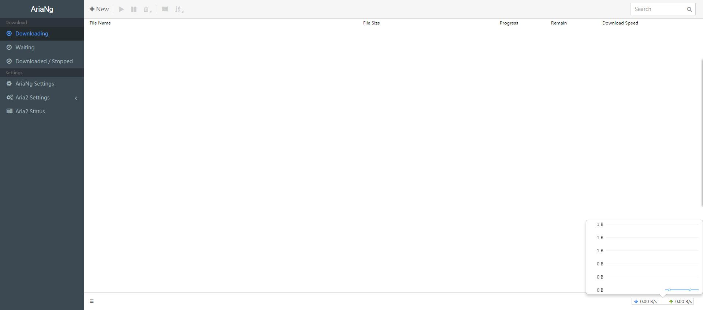

# AriaNG——高颜值的Aria2 WebUI
## 一.引
我之前用的是YAAW和Webui-aria2，前者够简洁，后者多了不少功能，但是……作为一个挑剔的人，我还是一直觉得它们不够漂亮，不过前几天我在群里发现有人发了张截图，我现在找不到了，就自己截了张

啧啧啧，是不是很棒？我当时一下子就被吸引住了，然后看到左上角这个名字后就去找了下，发现这个是7月多才初步开发完成的，怪不得我之前没见到过。作者的GITHUB：[传送门](https://github.com/mayswind/AriaNg)

以下为作者原话

>觉得以前 aria2 的前端都不好用，就自己重新撸了一个，功能覆盖了 Aria2 WebUI 和 YAAW 的功能。
与之前的前端相比，主要优势在于:   
>1. 完全响应式布局，电脑和手机等设备全部支持。  
>2. 更友好的用户界面，使用起来更像常用的下载工具。
>>+ 下载任务列表支持排序（文件名、大小、进度、剩余时间、下载速度等）和搜索，正在等待的任务列表支持拖拽安排下载顺序。
>>+ 任务详情页面支持健康度等参数的显示，文件和BT节点列表支持排序，文件列表支持按文件类型筛选选择，BT节点列表支持显示每个节点的任务完成状态等信息。
>>+ 新建任务页面支持直接手动下载等。
>>+ 提供完整的 aria2 设置支持，支持 aria2 所有设置的说明、修改等，设置界面全部中文。
>3. 支持下载完成通知（仅支持 Webscoket 协议及 Chrome 等现代浏览器）。
>4. 支持自定义使用的协议，Http(s) 或 Websocket 可任选。（Http(s) 协议支持压缩，减少带宽）
>5. 数据增量更新，减少带宽使用。

## 二.走起
其实这部分完全没用= =，因为安装实在太简答了……只要去github上下载然后解压就行……不丢服务器上直接本地打开都行……这真是太棒了！

Latest Release: https://github.com/mayswind/AriaNg/releases

Latest Daily Build: https://raw.githubusercontent.com/mayswind/AriaNg/gh-pages/downloads/latest_daily_build.zip

以上为GITHUB README中链接，可以自行选择下载，然后配置的话这个是支持简体中文/英文的，所以不多说了，应该没啥问题。然后，走起，享受高速下载吧~~~