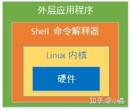
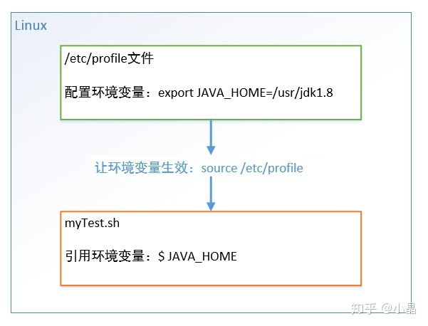

本文首先介绍了 Shell 编程是什么，并带大家快速入门，随后讲解 Shell 的基本语法并结合案例重点分析用法。包括 Shell 流程控制和自定义函数等。
## Shell 是什么？
Shell 是一个命令解释权，它为用户提供了一个向 Linux 内核发送请求以便运行程序界面系统级程序，用户可以用 Shell 来启动、挂起、停止甚至是编写一些程序。



## Shell 编程快速入门
进入 Linux 终端，编写一个 Shell 脚本 hello.sh ：
```bash
#!/bin/bash 
echo 'hello world!'
```
运行：
```bash
# 方法1 
sh hello.sh  

# 方法2 
chmod +x hello.sh 
./hello.sh
```
终端打印出 `hello world!` 。

**说明：**

- `#!` 告诉系统这个脚本需要什么解释器来执行。
- 文件扩展名 .sh 不是强制要求的。
- 方法1 直接运行解释器，hello.sh 作为 Shell 解释器的参数。此时 Shell 脚本就不需要指定解释器信息，第一行可以去掉。
- 方法2 hello.sh 作为可执行程序运行，Shell 脚本第一行一定要指定解释器。
## Shell 变量
定义
Shell 变量分为**系统变量**和**自定义变量**。系统变量有$HOME、$PWD、$USER等，显示当前 Shell 中所有变量：set 。
变量名可以由字母、数字、下划线组成，不能以数字开头。
### 基本语法

- **定义变量**：变量名=变量值，等号两侧不能有空格，变量名一般习惯用大写。
- **删除变量**：unset 变量名 。
- **声明静态变量**：readonly 变量名，静态变量不能unset。
- **使用变量**：$变量名
### 将命令返回值赋给变量（重点）

- A=	&#96;ls	&#96; 反引号,执行里面的命令
A=$(ls) 等价于反引号
## Shell 环境变量
### 定义



### 基本语法

1. export 变量名=变量值，将 Shell 变量输出为环境变量。
2. source 配置文件路径，让修改后的配置信息立即生效。
3. echo $变量名，检查环境变量是否生效
## 位置参数变量
### 基本语法

- $n ：$0 代表命令本身、$1-$9 代表第1到9个参数，10以上参数用花括号，如 ${10}。
- $* ：命令行中所有参数，且把所有参数看成一个整体。
- $@ ：命令行中所有参数，且把每个参数区分对待。
- $# ：所有参数个数。
### 实例：
编写 Shell 脚本 positionPara.sh ，输出命令行输入的各个参数信息。
```bash
#!/bin/bash     
# 输出各个参数 
echo $0 $1 $2 
echo $* 
echo $@ 
echo 参数个数=$#
```
运行：
```bash
chmod +x positionPara.sh 
./positionPara.sh 10 20
```
运行结果：
```bash
./positionPara.sh 10 20 
10 20 
10 20 
参数个数=2
```
## 预定义变量
### 定义
在赋值定义之前，事先在 Shell 脚本中直接引用的变量。
### 基本语法

- $$ ：当前进程的 PID 进程号。
- $! ：后台运行的最后一个进程的 PID 进程号。
- $? ：最后一次执行的命令的返回状态，0为执行正确，非0执行失败。
### 实例：
编写 Shell 脚本 prePara.sh ，输出命令行输入的各个参数信息。
```bash
#!/bin/bash     
echo 当前的进程号=$$ 
# &：以后台的方式运行程序 
./hello.sh & 
echo 最后一个进程的进程号=$! 
echo 最后执行的命令结果=$?
```
运行结果：
```bash
当前的进程号=41752 
最后一个进程的进程号=41753 
最后执行的命令结果=0 # hello world!
```
## 运算符
### 基本语法

- $((运算式)) 或 $[运算式]
- expr m + n 注意 expr 运算符间要有空格
- expr m - n
- expr \*，/，% 分别代表乘，除，取余
### 实例
```bash
# 第1种方式 $(()) 
echo $(((2+3)*4))   

# 第2种方式 $[]，推荐 
echo $[(2+3)*4]  

# 使用 expr 
TEMP=`expr 2 + 3` 
echo `expr $TEMP \* 4`
```
## 条件判断
### 基本语法
[ condition ] 注意condition前后要有空格。非空返回0，0为 true，否则为 false 。
### 实例
```bash
#!/bin/bash 
if [ 'test01' = 'test' ] 
then
     echo '等于' 
fi  

# 20是否大于10 
if [ 20 -gt 10] 
then
     echo '大于' 
fi  

# 是否存在文件/root/shell/a.txt 
if [ -e /root/shell/a.txt ] 
then
     echo '存在' 
fi  

if [ 'test02' = 'test02' ] && echo 'hello' || echo 'world' 
then
     echo '条件满足，执行后面的语句' 
fi
```
运行结果：
```bash
大于 
hello 
条件满足，执行后面的语句
```
## 流程控制
### if 判断
#### 基本语法
```bash
if [ 条件判断式 ];then   
    程序   
fi

# 或者（推荐）
if [ 条件判断式 ]
then
    程序
elif [ 条件判断式 ]
then
    程序
fi
```
#### 实例
编写 Shell 程序：如果输入的参数大于60，输出“及格”，否则输出“不及格”。
```bash
#!/bin/bash
if [ $1 -ge 60 ]
then
    echo 及格
elif [ $1 -lt 60 ]
then
    echo "不及格" 
fi
```
### case 分支
#### 基本语法
```bash
case $变量名 in
"值1")
如果变量值等于值1，则执行此处程序1
;;
"值2")
如果变量值等于值2，则执行此处程序2
;;
...省略其它分支...
*)
如果变量值不等于以上列出的值，则执行此处程序
;;
esac
```
#### 实例
当命令行参数为1时输出“周一”，2时输出“周二”，其他情况输出“其它”。
```bash
case $1 in
"1")
echo 周一
;;
"2")
echo 周二
;;
*)
echo 其它
;;
esac
```
### for 循环
#### 基本语法
```bash
# 语法1
for 变量名 in 值1 值2 值3...
do
    程序
done

# 语法2
for ((初始值;循环控制条件;变量变化))
do
    程序
done
```
#### 实例
打印命令行输入的参数。
```bash
#!/bin/bash  

# 使用$* 
for i in "$*" 
do     
    echo "the arg is $i" 
done 
echo "=================="  

# 使用$@ 
for j in "$@" 
do     
    echo "the arg is $j" 
done
```
运行结果（回顾一下 $* 和 $@ 的区别）：
```bash
the arg is 1 2 3 
================== 
the arg is 1 
the arg is 2 
the arg is 3
```
2. 输出从1加到100的值。
```bash
#!/bin/bash 
SUM=0  
for ((i=1;i<=100;i++)) 
do     
    SUM=$[$SUM+$i] 
done 

echo $SUM
```
### while 循环
#### 基本语法
```bash
while [ 条件判断式 ]
do
    程序
done 
```
#### 实例
输出从1加到100的值。
```bash
#!/bin/bash
SUM=0
i=0

while [ $i -le $1 ]
do
    SUM=$[$SUM+$i]
    i=$[$i+1]
done       
echo $SUM
```
## 读取控制台输入
### 基本语法
`read(选项)(参数)`
### 选项

* -p：指定读取值时的提示符
* -t：指定读取值时等待的时间（秒），如果没有在指定时间内输入，就不再等待了。
### 参数

* 变量名：读取值的变量名
### 实例
读取控制台输入一个num值。
```bash
#!/bin/bash

read -p "请输入一个数num1=" NUM1
echo "你输入num1的值是：$NUM1"

read -t 10 -p "请在10秒内输入一个数num2=" NUM2
echo "你输入num2的值是：$NUM2"
```
运行结果：
```bash
请输入一个数num1=10
你输入num1的值是：10
请在10秒内输入一个数num2=20
你输入num2的值是：20
```
## 函数
和其它编程语言一样，Shell 编程有系统函数和自定义函数，本文只举两个常用系统函数。

## 系统函数
1. **basename**，删掉路径最后一个 / 前的所有部分（包括/），常用于获取文件名。
    #### 基本语法
    - basename [pathname] [suffix]
    - basename [string] [suffix]
    - 如果指定 suffix，也会删掉pathname或string的后缀部分。
    #### 实例
    ```bash
    # basename /usr/bin/sort  
    sort  

    # basename include/stdio.h  
    stdio.h  

    # basename include/stdio.h .h 
    stdio
    ```
2. **dirname**，删掉路径最后一个 / 后的所有部分（包括/），常用于获取文件路径。
    #### 基本语法
    dirname pathname
    如果路径中不含 / ，则返回 '.' （当前路径）。
    实例
    ```bash
    # dirname /usr/bin/  
    /usr  

    # dirname dir1/str dir2/str 
    dir1 
    dir2  

    # dirname stdio.h 
    .
    ```
## 自定义函数
### 基本语法
```bash
[ function ] funname[()]
{
    Action;
    [return int;]
}

# 调用
funname 参数1 参数2...
```
### 实例
计算输入两个参数的和。
```bash
#!/bin/bash

function getSum(){
    SUM=$[$n1+$n2]
    echo "sum=$SUM"
}   

read -p "请输入第一个参数n1：" n1
read -p "请输入第二个参数n2：" n2

# 调用 getSum 函数
getSum $n1 $n2
```
恭喜！你已经掌握了 Shell 的基本语法，入门很简单。

## 更多干货
### 不看后悔系列：

- Linux针对很多常用命令增加了很多新的更加有用高效的新命令，这些命令不但可以大大提高工作效率和体验，让你在同事面前装那啥的利器，如果能在面试新工作时提起这类命令，更是能给面试官眼前一亮的加分项，下面展示了几个在工作中最常用的命令。

- 如果你想要有语法高亮的 cat，可以试试 ccat 命令。
exa 增强了 ls 命令，如果你需要在很多目录上浏览各种文件 ，ranger 命令可以比 cd 和 cat 更有效率，甚至可以在你的终端预览图片。
- fd 是一个比 find 更简单更快的命令，他还会自动地忽略掉一些你配置在 .gitignore 中的文件，以及 .git 下的文件。
- fzf 会是一个很好用的文件搜索神器，其主要是搜索当前目录以下的文件，还可以使用 fzf --preview 'cat {}'边搜索文件边浏览内容。
- grep 是一个上古神器，然而，ack、ag 和 rg 是更好的grep，和上面的 fd一样，在递归目录匹配的时候，会使用你配置在 .gitignore 中的规则。
- rm 是一个危险的命令，尤其是各种 rm -rf …，所以，trash 是一个更好的删除命令。
- man 命令是好读文档的命令，但是man的文档有时候太长了，所以，你可以试试 tldr 命令，把文档上的一些示例整出来给你看。
如果你想要一个图示化的ping，你可以试试 prettyping 。
如果你想搜索以前打过的命令，不要再用 Ctrl +R 了，你可以使用加强版的 hstr 。
- htop 是 top 的一个加强版。然而，还有很多的各式各样的top，比如：用于看IO负载的 iotop，网络负载的 iftop, 以及把这些top都集成在一起的 atop。
- ncdu 比 du 好用多了。另一个选择是 nnn。
- 如果你想把你的命令行操作录制成一个 SVG 动图，那么你可以尝试使用 asciinema 和 svg-trem 。
- httpie 是一个可以用来替代 curl 和 wget 的 http 客户端，httpie 支持 json 和语法高亮，可以使用简单的语法进行 http 访问: http -v github.com。
- tmux 在需要经常登录远程服务器工作的时候会很有用，可以保持远程登录的会话，还可以在一个窗口中查看多个 shell 的状态。
- sshrc 是个神器，在你登录远程服务器的时候也能使用本机的 - shell 的 rc 文件中的配置。
- goaccess 这个是一个轻量级的分析统计日志文件的工具，主要是分析各种各样的 access log。
