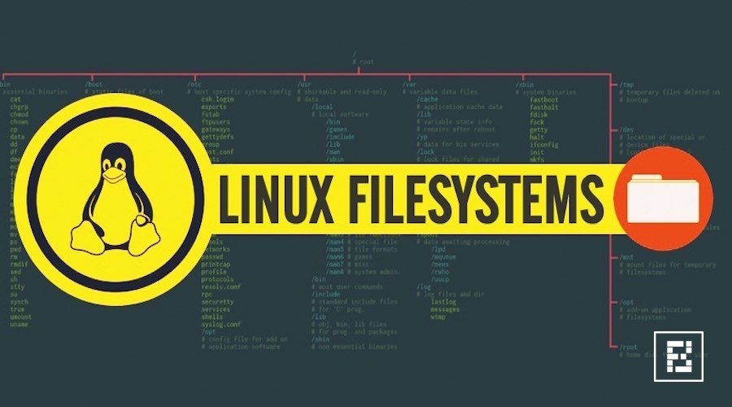

既然这篇叫文件系统概述，那我们就来说一下什么是文件系统。我没有查阅有没有教科书的定义，从操作系统概念上讲，文件系统可以说与进程调度、内存管理等子系统并驾齐驱的一大子系统，主要负责数据的组织、存储与检索。它不是指一个实体的存储设备，而是指管理存储数据的格式与方法。

## 文件系统和存储组织形式的关系
我记得知乎上曾有人问分区表和文件系统有什么关系，我当时就简单的回答了一句“没有任何关系”。分区表代表的对存储设备分区域管理的概念，分区之后的每一块区域对于文件系统来说都是独立的存储设备，本地文件系统（如ExtN, XFS, NTFS等）都是架设在一块或几块（如果有子卷管理）存储设备上的，对分区表没有任何要求。比如你有一块磁盘或U盘显示为/dev/sdb，你可以在/dev/sdb上直接做文件系统然后挂载/dev/sdb：
```bash
# mkfs.xfs -f /dev/sdb
meta-data=/dev/sdb               isize=512    agcount=4, agsize=57600000 blks
         =                       sectsz=512   attr=2, projid32bit=1
         =                       crc=1        finobt=0, sparse=0
data     =                       bsize=4096   blocks=230400000, imaxpct=25
         =                       sunit=0      swidth=0 blks
naming   =version 2              bsize=4096   ascii-ci=0 ftype=1
log      =internal log           bsize=4096   blocks=112500, version=2
         =                       sectsz=512   sunit=0 blks, lazy-count=1
realtime =none                   extsz=4096   blocks=0, rtextents=0
# mount /dev/sdb /mnt/scratch
# cat /proc/mounts |grep /dev/sdb
/dev/sdb /mnt/scratch xfs rw,seclabel,relatime,attr2,inode64,noquota 0 0
# umount /dev/sdb
```
也可以先对其分区，如分出/dev/sdb1和/dev/sdb2，然后在sdb1和sdb2上分别做文件系统并挂载:
```bash
# fdisk -l /dev/sdb
   Device Boot      Start         End      Blocks   Id  System
/dev/sdb1            2048    20973567    10485760   83  Linux
/dev/sdb2        20973568    41945087    10485760   83  Linux
# mkfs.xfs -f /dev/sdb1
# mkfs.ext4 -F /dev/sdb2
# mount /dev/sdb1 /mnt/test && mount /dev/sdb2 /mnt/scratch
# cat /proc/mounts |grep /dev/sdb
/dev/sdb1 /mnt/test xfs rw,seclabel,relatime,attr2,inode64,noquota 0 0
/dev/sdb2 /mnt/scratch ext4 rw,seclabel,relatime,data=ordered 0 0
# umount /dev/sdb1 && umount /dev/sdb2
```
你甚至还可以将sdb1和sdb2先做成LVM，然后在这个dm设备上做文件系统并挂载：
```bash
# pvcreate /dev/sdb1 /dev/sdb2
# vgcreate testvg /dev/sdb1 /dev/sdb2
# lvcreate -L 10G -n testdev testvg
# mkfs.xfs -f /dev/testvg/testdev
# mount /dev/testvg/testdev /mnt/test
# cat /proc/mounts |grep testdev
/dev/mapper/testvg-testdev /mnt/test xfs rw,seclabel,relatime,attr2,inode64,noquota 0 0
```
更甚者，如果你愿意你可以给这个由两个分区做出来的一个LVM设备再分区，再在LVM的分区上再做文件系统并挂载（不展示那么多了，只展示分区部分）：
```bash
# fdisk /dev/testvg/testdev 

Command (m for help): n
Partition type:
   p   primary (0 primary, 0 extended, 4 free)
   e   extended
Select (default p): p
Partition number (1-4, default 1): 
First sector (2048-20971519, default 2048): 
Using default value 2048
Last sector, +sectors or +size{K,M,G} (2048-20971519, default 20971519): +5G
Partition 1 of type Linux and of size 5 GiB is set

Command (m for help): p

Disk /dev/testvg/testdev: 10.7 GB, 10737418240 bytes, 20971520 sectors
Units = sectors of 1 * 512 = 512 bytes
Sector size (logical/physical): 512 bytes / 512 bytes
I/O size (minimum/optimal): 512 bytes / 512 bytes
Disk label type: dos
Disk identifier: 0x5d025e0f

              Device Boot      Start         End      Blocks   Id  System
/dev/testvg/testdev1            2048    10487807     5242880   83  Linux
```
当然你还可以有更“变态”的操作，而这一切说明的就是文件系统和其底层的存储设备是什么样子的，理论上是没有关系的（当然如果存储有问题那文件系统可能也不能工作）。


## 如何使用文件系统
使用一个文件系统最重要的两个步骤一个是创建一个是挂载，创建文件系统（windows下好像俗称格式化），意思就是将文件系统的基本组织格式写道存储设备上。这些基本组织格式包括数据块大小，超级块信息，Free space组织结构等等，这里不做展开讨论，以后说到具体某个文件系统的on-disk结构时再说。总之创建文件系统是第一步。

有了一个文件系统后我们并不能直接访问它，你可以访问文件系统所在的磁盘，比如你对磁盘进行读写操作都没问题。但是文件系统不能在未挂载的情况下使用，我后面可能也会用几个篇幅讲挂载，这里就先简单说一下。同样，这里我也没有查挂载是否有教科书定义，从我的理解来说，挂载就是将存储设备上的文件和目录和已有目录树关联，让你可以通过文件系统的逻辑来访问存储设备。有人可能会问windows下他从没见过挂载一个设备这种事，我不想对windows的逻辑做过多解释，只能说实际上windows也是挂载的，只是它把根目录隐藏了起来，把挂载点以盘符的形式展示给你。这也是用贯windows的人转用Linux后很难理解的其中一个问题“盘符在哪里”。

## 现有文件系统有哪些（随便说两句）
这个真是一个很难说清楚的数字，从历史的长河来看，出现过的文件系统非常多。现在大家比较熟知的是NTFS, Ext2/3/4，ZFS，XFS，Btrfs，NFS等。这些是目前比较主流的文件系统，其中NFS不是本地文件系统，它是通过网络虚拟出文件系统的概念来访问Server端数据，其数据端往往架设在一个现有的本地文件系统之上（如ext4），然后export出一个挂载点，供Client端挂载使用。类似这样概念的文件系统还有很多。

### NTFS:

Windows当前的默认文件系统，由于版权和组织格式（对inode不友好）等原因没有被Linux内核直接支持，但可以通过ntfs-3g用户态软件包配合Linux的FUSE机制来使用windows的NTFS文件系统。当你在Linux上插一块带有NTFS文件系统的U盘或硬盘时，挂载的时候Linux就会这样做。

### ExtN:

Ext系列是Linux的老牌文件系统了，一直是Linux的主打，从Ext3开始支持日志，Ext4更加完善了很多功能。目前看好像没有Ext5这种打算，没看见Ted提过。由于其组织形式的限制，很难将很多现代文件系统的功能加进去，所以Linux才会出Btrfs项目企图重头开发一个功能强劲的文件系统。

### Btrfs:

Btrfs的目标很远大，从创立之初就被冠以Linux下一代主打文件系统的称号。但是由于各种原因其一直不能足够稳定（这里说的是面对企业级应用级别，普通用户足够用）。RedHat一直没有将其纳入自己的系统主流，可见其确实bug不断。虽然SUSE选择的是Btrfs，但是也是在一定范围内支持，很多功能是不提供稳定保证的。希望Btrfs能越来越好。

### ZFS:

这个可厉害了，它可以说是“目前最好”的文件系统（个人认为，抬杠就免了），功能强大且稳定。Btrfs也是很大程度上想超越至少看齐ZFS的。可惜ZFS只在Solaris上提供最新最全的功能，BSD上还是略逊，Linux上则没有这个直接支持。虽然有ZFSonLinux这个项目，但是那是另一个概念，不讨论了。

### XFS:

RedHat当前的主流文件系统，以支持大存储大数据量为目标，目前上游开发活跃发展迅速，也是我主要为之服务的文件系统。后面我会有更多文章涉及XFS具体细节，这里就不多说了。

### *VFS:

这里我列一下VFS是为了强调一下，这个不是文件系统，这是一个文件系统上层的抽象，不是具体的某个文件系统。你跟人说文件系统包括VFS，就好像你说你编程语言学的VC++一样。

---

嗯……乱七八糟的也说了这么多了，果然概述这种东西还是很容易收不住也很容易说乱了。这第一篇文章就在这收尾吧。没什么实质性的内容，知道的人就别浪费时间看我这瞎掰了，不知道而感兴趣的就好得看看就行。尽信书不如无书，我这里说的已经不知道是第几手的知识传递了，如遇与你所知不符还是以一手材料为准。