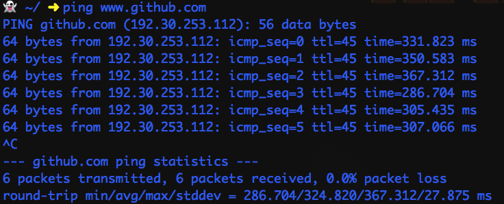
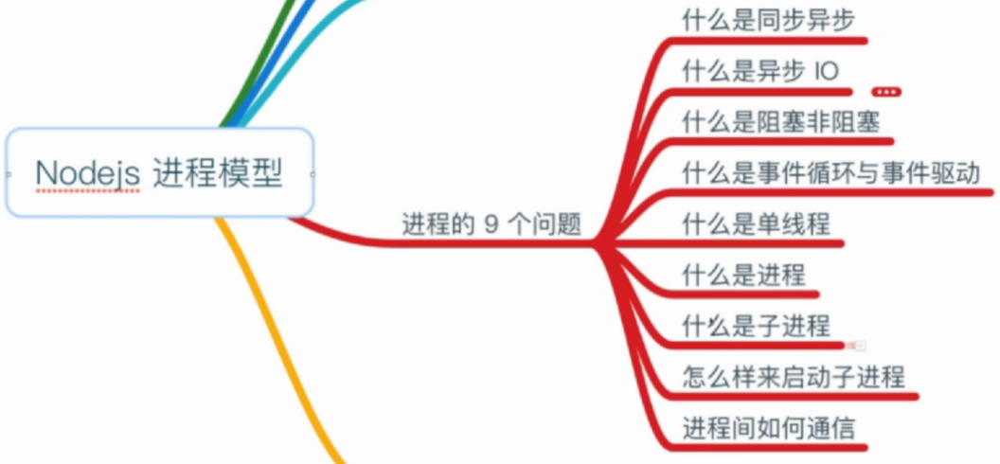
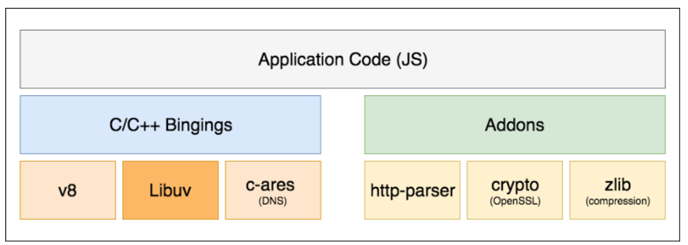
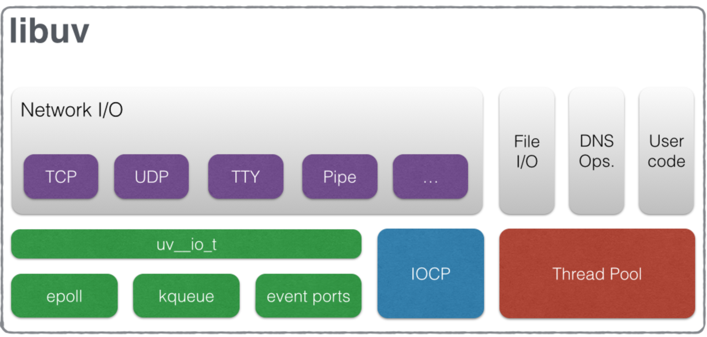
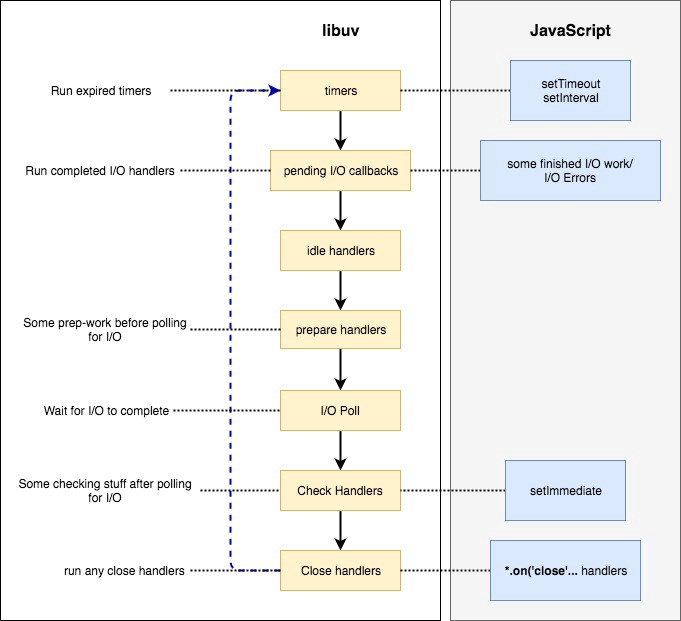
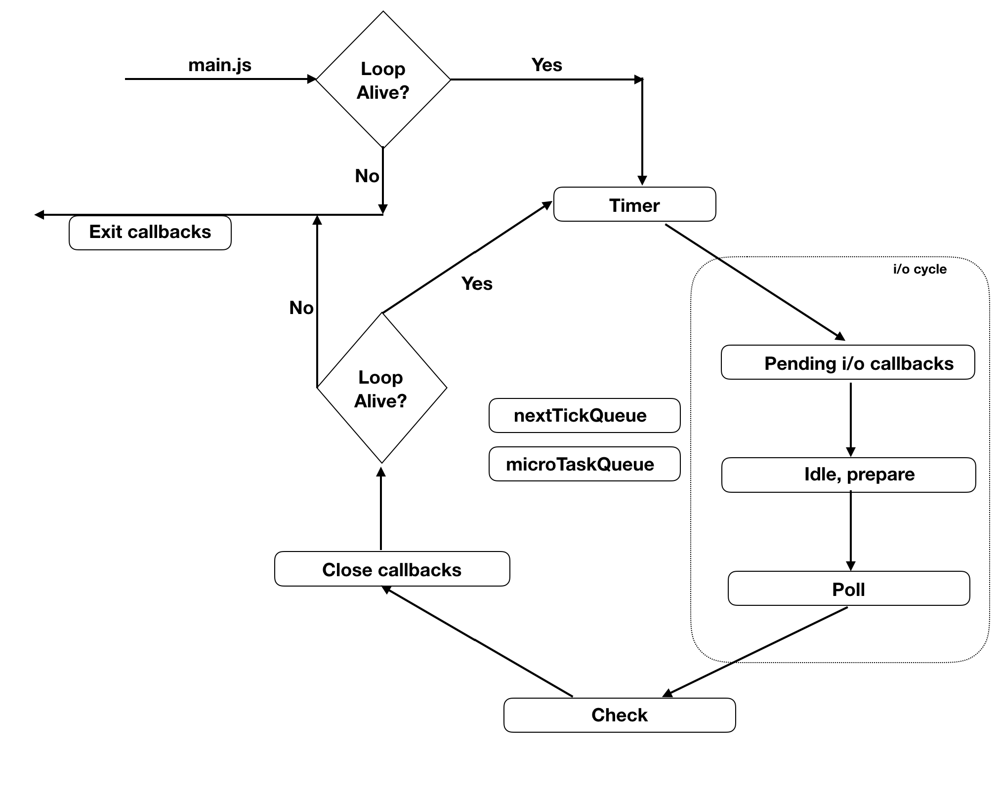
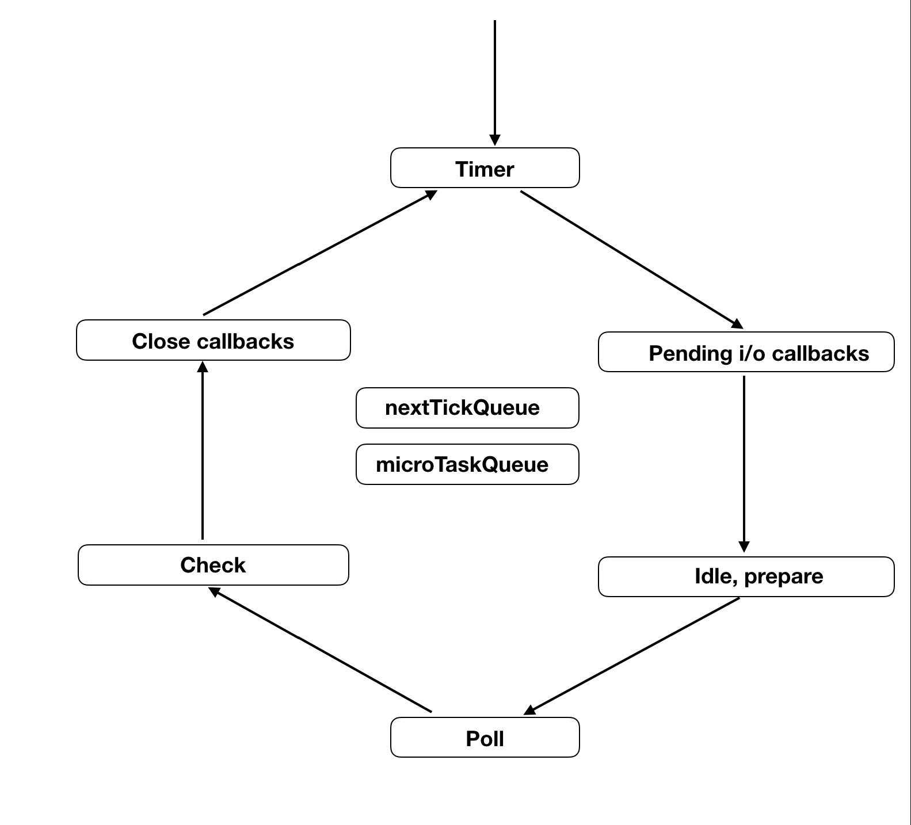
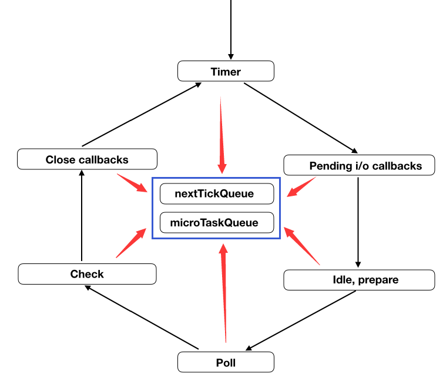
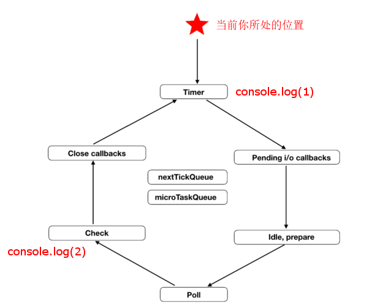

>多数的网站不需要大量计算，程序花费的时间主要集中在磁盘 I/O 和网络 I/O 上面

SSD读取很快，但和CPU处理指令的速度比起来也不在一个数量级上，而且网络上一个数据包来回的时间更慢：



一个数据包来回的延迟平均320ms(我网速慢，ping国内网站会更快)，这段时间内一个普通 cpu 执行几千万个周期应该没问题

因此异步IO就要发挥作用了，比如用多线程，如果用 Java 去读一个文件，这是一个阻塞的操作，在等待数据返回的过程中什么也干不了，因此就开一个新的线程来处理文件读取，读取操作结束后再去通知主线程。

这样虽然行得通，但是代码写起来比较麻烦。像 Node.js V8 这种无法开一个线程的怎么办？

## 1. 什么是Node.js进程
我们可以先默默地回答下下面的9个问题，是否都清楚呢?


### 1.1 异步IO
异步IO是指操作系统提供的IO（数据进出）的能力，比如键盘输入，对应到显示器上会有专门的数据输出接口，这就是我们生活中可见的IO能力；这个接口在向下会进入到操作系统这个层面，在操作系统中，会提供诸多的能力，比如：磁盘的读写，DNS的查询，数据库的连接啊，网络请求的处理，等等；

在不同的操作系统层面，表现的不一致。有的是异步非阻塞的；有的是同步的阻塞的，无论如何，我们都可以看做是上层应用于下层系统之间的数据交互；上层依赖于下层，但是反过来，上层也可以对下层提供的这些能力进行改造；如果这种操作是异步的，非阻塞的，那么这种就是异步非阻塞的异步IO模型；如果是同步的阻塞的，那么就是同步IO模型；

**koa**就是一个上层的web服务框架，全部由js实现，他有操作系统之间的交互，全部通过nodejs来实现；如nodejs的 readFile就是一个异步非阻塞的接口，readFileSync就是一个同步阻塞接口；到这里上面三个问题基本回答完毕；

### 1.2 时间循环
**事件循环**是指Node.js执行非阻塞I/O操作，尽管JavaScript是单线程的,但由于大多数内核都是多线程的，node.js会尽可能将操作装载到系统内核。因此它们可以处理在后台执行的多个操作。当其中一个操作完成时，内核会告诉Node.js，以便node.js可以将相应的回调添加到轮询队列中以最终执行。

### 1.3 总结
nodejs是单线程执行的，同时它又是基于**事件驱动**的**非阻塞IO**编程模型。这就使得我们不用等待异步操作结果返回，就可以继续往下执行代码。当异步事件触发之后，就会通知主线程，主线程执行相应事件的回调。

## 2. Nodejs 架构分析
说道 Nodejs 架构, 首先要直到 Nodejs 与 V8 和 libUV 的关系和作用:
- **V8**: 执行 JS 的引擎. 也就是翻译 JS. 包括我们熟悉的编译优化, 垃圾回收等等.
- **libUV**: 提供 async I/O, 提供消息循环. 可见, 是操作系统 API 层的一个抽象层.

那么 Nodejs 如何组织它们呢?



### 2.1 Application Code(JS)
>框架代码以及用户代码即我们编写的应用程序代码. npm包. nodejs内置的js模块等，我们日常工作中的大部分时间都是编写这个层面的代码。

### 2.2 binding代码
>binding代码或者三方插件（js 或 C/C++ 代码）胶水代码.

能够让js调用C/C++的代码。可以将其理解为一个桥，桥这头是js，桥那头是C/C++，通过这个桥可以让js调用C/C++。
在nodejs里，胶水代码的主要作用是把nodejs底层实现的C/C++库暴露给js环境。
三方插件是我们自己实现的C/C++库，同时需要我们自己实现胶水代码，将js和C/C++进行桥接。

Nodejs 通过一层 C++ Binding, 把 JS 传入 V8, V8 解析后交给 libUV 发起 asnyc I/O, 并等待消息循环调度.

### 2.3 底层库
>nodejs的依赖库，包括大名鼎鼎的V8. libuv。

- V8： 我们都知道，是google开发的一套高效javascript运行时，nodejs能够高效执行 js 代码的很大原因主要在它。
- libuv：是用C语言实现的一套异步功能库，nodejs高效的异步编程模型很大程度上归功于libuv的实现，而libuv则是我们今天重点要分析的。
  
还有一些其他的依赖库
- http-parser：负责解析http响应
- openssl：加解密
- c-ares：dns解析
- npm：nodejs包管理器

## 3. libuv 架构
我们知道，nodejs实现异步机制的核心便是libuv，libuv承担着nodejs与文件. 网络等异步任务的沟通桥梁，下面这张图让我们对libuv有个大概的印象：



这是libuv官网的一张图，很明显，nodejs的网络I/O. 文件I/O. DNS操作. 还有一些用户代码都是在 libuv 工作的。 既然谈到了异步，那么我们首先归纳下nodejs里的异步事件：

### 3.1 非 I/O操作：
定时器（setTimeout，setInterval）
- microtask（promise）
- process.nextTick
- setImmediate
- DNS.lookup
### 3.2 I/O操作：
- 网络I/O
对于网络I/O，各个平台的实现机制不一样，linux 是 epoll 模型，类 unix 是 kquene . windows 下是高效的 IOCP 完成端口. SunOs 是 event ports，libuv 对这几种网络I/O模型进行了封装。
- 文件I/O 与DNS操作

libuv内部还维护着一个默认4个线程的线程池，这些线程负责执行文件I/O操作. DNS操作. 用户异步代码。当 js 层传递给 libuv 一个操作任务时，libuv 会把这个任务加到队列中。之后分两种情况：

1. 线程池中的线程都被占用的时候，队列中任务就要进行排队等待空闲线程。

2. 线程池中有可用线程时，从队列中取出这个任务执行，执行完毕后，线程归还到线程池，等待下个任务。同时以事件的方式通知event-loop，event-loop接收到事件执行该事件注册的回调函数。

>当然，如果觉得4个线程不够用，可以在nodejs启动时，设置环境变量UV_THREADPOOL_SIZE来调整，出于系统性能考虑，libuv 规定可设置线程数不能超过128个。

## 4 Nodejs 线程模型
node.js启动过程可以分为以下步骤：

1. 调用platformInit方法 ，初始化 nodejs 的运行环境。

2. 调用 performance_node_start 方法，对 nodejs 进行性能统计。

3. openssl设置的判断。

4. 调用v8_platform.Initialize，初始化 libuv 线程池。

5. 调用 V8::Initialize，初始化 V8 环境。

6. 创建一个nodejs运行实例。

7. 启动上一步创建好的实例。

8. 开始执行js文件，同步代码执行完毕后，进入事件循环。

9. 在没有任何可监听的事件时，销毁 nodejs 实例，程序执行完毕。

以上就是 nodejs 执行一个js文件的全过程。接下来着重介绍第八个步骤，事件循环。



Nodejs 完全是单线程的. 从进程启动后, 由主线程加载我们的 js 文件(上图中 main.js), 然后进入消息循环. 可见对于 js 程序而言, 完整运行在单线程之中.



但并不是说 Node 进程只有一个线程. 正如 Node.js event loop workflow & lifecycle in low level 中所说:在 libUV 这一层实际上是有个线程池辅助完成一些工作的.

### 4.1 细说消息循环
再来看一下 JS 中的消息循环部分:



Nodejs 将消息循环又细分为 6 个阶段(官方叫做 Phase), 每个阶段都会有一个类似于队列的结构, 存储着该阶段需要处理的回调函数. 我们来看一下这 6 个 Phase 的作用,这六个阶段的核心代码如下：
```cpp
int uv_run(uv_loop_t* loop, uv_run_mode mode) {
  int timeout;
  int r;
  int ran_pending;
//判断事件循环是否存活。
  r = uv__loop_alive(loop);
  //如果没有存活，更新时间戳
  if (!r)
    uv__update_time(loop);
//如果事件循环存活，并且事件循环没有停止。
  while (r != 0 && loop->stop_flag == 0) {
    //更新当前时间戳
    uv__update_time(loop);
    //执行 timers 队列
    uv__run_timers(loop);
    //执行由于上个循环未执行完，并被延迟到这个循环的I/O 回调。
    ran_pending = uv__run_pending(loop); 
    //内部调用，用户不care，忽略
    uv__run_idle(loop); 
    //内部调用，用户不care，忽略
    uv__run_prepare(loop); 

    timeout = 0; 
    if ((mode == UV_RUN_ONCE && !ran_pending) || mode == UV_RUN_DEFAULT)
    //计算距离下一个timer到来的时间差。
      timeout = uv_backend_timeout(loop);
   //进入 轮询 阶段，该阶段轮询I/O事件，有则执行，无则阻塞，直到超出timeout的时间。
    uv__io_poll(loop, timeout);
    //进入check阶段，主要执行 setImmediate 回调。
    uv__run_check(loop);
    //进行close阶段，主要执行 **关闭** 事件
    uv__run_closing_handles(loop);

    if (mode == UV_RUN_ONCE) {

      //更新当前时间戳
      uv__update_time(loop);
      //再次执行timers回调。
      uv__run_timers(loop);
    }
    //判断当前事件循环是否存活。
    r = uv__loop_alive(loop); 
    if (mode == UV_RUN_ONCE || mode == UV_RUN_NOWAIT)
      break;
  }

  /* The if statement lets gcc compile it to a conditional store. Avoids
   * dirtying a cache line.
   */
  if (loop->stop_flag != 0)
    loop->stop_flag = 0;

  return r;
}
```

### 4.2 Timer Phase
这是消息循环的第一个阶段, 用一个 **for** 循环处理所有 **setTimeout** 和 **setInterval** 的回调. 核心代码如下：
```cpp
void uv__run_timers(uv_loop_t* loop) {
  struct heap_node* heap_node;
  uv_timer_t* handle;

  for (;;) {
  //取出定时器堆中超时时间最近的定时器句柄
    heap_node = heap_min((struct heap*) &loop->timer_heap);
    if (heap_node == NULL)
      break;

    handle = container_of(heap_node, uv_timer_t, heap_node);
    // 判断最近的一个定时器句柄的超时时间是否大于当前时间，如果大于当前时间，说明还未超时，跳出循环。
    if (handle->timeout > loop->time)
      break;
    // 停止最近的定时器句柄
    uv_timer_stop(handle);
    // 判断定时器句柄类型是否是repeat类型，如果是，重新创建一个定时器句柄。
    uv_timer_again(handle);
    //执行定时器句柄绑定的回调函数
    handle->timer_cb(handle);
  }
}
```

这些回调被保存在一个最小堆(min heap) 中. 这样引擎只需要每次判断头元素, 如果符合条件就拿出来执行, 直到遇到一个不符合条件或者队列空了, 才结束 Timer Phase.

Timer Phase 中判断某个回调是否符合条件的方法也很简单. 消息循环每次进入 Timer Phase 的时候都会保存一下当时的系统时间,然后只要看上述最小堆中的回调函数设置的启动时间是否超过进入 Timer Phase 时保存的时间, 如果超过就拿出来执行.

此外, Nodejs 为了防止某个 Phase 任务太多, 导致后续的 Phase 发生饥饿的现象, 所以消息循环的每一个迭代(iterate) 中, 每个 Phase 执行回调都有个最大数量. 如果超过数量的话也会强行结束当前 Phase 而进入下一个 Phase. 这一条规则适用于消息循环中的每一个 Phase.

### 4.3 Pending I/O Callback Phase
这一阶段是执行你的 **fs.read**, **socket** 等 IO 操作的回调函数, 同时也包括各种 error 的回调.

### 4.4 Idle, Prepare Phase
据说是内部使用, 所以我们也不在这里过多讨论.

### 4.5 Poll Phase
这是整个消息循环中最重要的一个 Phase, 作用是等待异步请求和数据(原文: *accepts new incoming connections (new socket establishment etc) and data (file read etc)*).
说它最重要是因为它支撑了整个消息循环机制.

Poll Phase 首先会执行 **watch_queue** 队列中的 IO 请求, 一旦 watch_queue 队列空, 则整个消息循环就会进入 sleep , 从而等待被内核事件唤醒. 源码在这里:
```cpp
void uv__io_poll(uv_loop_t* loop, int timeout) {
  /*一连串的变量初始化*/
  //判断是否有事件发生    
  if (loop->nfds == 0) {
    //判断观察者队列是否为空，如果为空，则返回
    assert(QUEUE_EMPTY(&loop->watcher_queue));
    return;
  }

  nevents = 0;
  // 观察者队列不为空
  while (!QUEUE_EMPTY(&loop->watcher_queue)) {
    /*
    取出队列头的观察者对象
    取出观察者对象感兴趣的事件并监听。
    */
    ....省略一些代码
    w->events = w->pevents;
  }


  assert(timeout >= -1);
  //如果有超时时间，将当前时间赋给base变量
  base = loop->time;
  // 本轮执行监听事件的最大数量
  count = 48; /* Benchmarks suggest this gives the best throughput. */
  //进入监听循环
  for (;; nevents = 0) {
  // 有超时时间的话，初始化spec
    if (timeout != -1) {
      spec.tv_sec = timeout / 1000;
      spec.tv_nsec = (timeout % 1000) * 1000000;
    }

    if (pset != NULL)
      pthread_sigmask(SIG_BLOCK, pset, NULL);
    // 监听内核事件，当有事件到来时，即返回事件的数量。
    // timeout 为监听的超时时间，超时时间一到即返回。
    // 我们知道，timeout是传进来得下一个timers到来的时间差，所以，在timeout时间内，event-loop会一直阻塞在此处，直到超时时间到来或者有内核事件触发。
    nfds = kevent(loop->backend_fd,
                  events,
                  nevents,
                  events,
                  ARRAY_SIZE(events),
                  timeout == -1 ? NULL : &spec);

    if (pset != NULL)
      pthread_sigmask(SIG_UNBLOCK, pset, NULL);

    /* Update loop->time unconditionally. It's tempting to skip the update when
     * timeout == 0 (i.e. non-blocking poll) but there is no guarantee that the
     * operating system didn't reschedule our process while in the syscall.
     */
    SAVE_ERRNO(uv__update_time(loop));
    //如果内核没有监听到可用事件，且本次监听有超时时间，则返回。
    if (nfds == 0) {
      assert(timeout != -1);
      return;
    }

    if (nfds == -1) {
      if (errno != EINTR)
        abort();

      if (timeout == 0)
        return;

      if (timeout == -1)
        continue;

      /* Interrupted by a signal. Update timeout and poll again. */
      goto update_timeout;
    }

    。。。
    //判断事件循环的观察者队列是否为空
    assert(loop->watchers != NULL);
    loop->watchers[loop->nwatchers] = (void*) events;
    loop->watchers[loop->nwatchers + 1] = (void*) (uintptr_t) nfds;
    // 循环处理内核返回的事件，执行事件绑定的回调函数
    for (i = 0; i < nfds; i++) {
        。。。。
    }

}
```
**uv__io_poll**阶段源码最长，逻辑最为复杂，可以做个概括，如下： 当js层代码注册的事件回调都没有返回的时候，事件循环会阻塞在poll阶段。看到这里，你可能会想了，会永远阻塞在此处吗？当然 Poll Phase 不能一直等下去.

它有着精妙的设计. 简单来说,

1. 它首先会判断后面的 **Check Phase** 以及 **Close Phase** 是否还有等待处理的回调. 如果有, 则不等待, 直接进入下一个 Phase.

2. 如果没有其他回调等待执行, 它会给 **epoll** 这样的方法设置一个 timeout.

>可以猜一下, 这个 timeout 设置为多少合适呢? 答案就是 Timer Phase 中最近要执行的回调启动时间到现在的差值, 假设这个差值是 detal. 因为 Poll Phase 后面没有等待执行的回调了. 所以这里最多等待 delta 时长, 如果期间有事件唤醒了消息循环, 那么就继续下一个 Phase 的工作; 如果期间什么都没发生, 那么到了 timeout 后, 消息循环依然要进入后面的 Phase, 让下一个迭代的 Timer Phase 也能够得到执行.
Nodejs 就是通过 Poll Phase, 对 IO 事件的等待和内核异步事件的到达来驱动整个消息循环的.

### 4.6 Check Phase
接下来是 Check Phase. 这个阶段只处理 **setImmediate** 的回调函数.  
那么为什么这里要有专门一个处理 **setImmediate** 的 Phase 呢? 简单来说, 是因为 Poll Phase 阶段可能设置一些回调, 希望在 Poll Phase 后运行. 所以在 Poll Phase 后面增加了这个 Check Phase.

### 4.7 Close Callbacks Phase
专门处理一些 close 类型的回调. 比如 `socket.on('close', ...)`. 用于资源清理.

## 5 Node.js事件循环原理
* node 的初始化
  - 初始化 node 环境。
  - 执行输入代码。
  - 执行 process.nextTick 回调。
  - 执行 microtasks。
*  进入 event-loop
   1. 进入 timers 阶段

       * 检查 timer 队列是否有到期的 timer 回调，如果有，将到期的 timer 回调按照 timerId 升序执行。
       * 检查是否有 process.nextTick 任务，如果有，全部执行。
       * 检查是否有microtask，如果有，全部执行。
       * 退出该阶段。
   2. 进入IO callbacks阶段。

      * 检查是否有 pending 的 I/O 回调。如果有，执行回调。如果没有，退出该阶段。
       * 检查是否有 process.nextTick 任务，如果有，全部执行。
      * 检查是否有microtask，如果有，全部执行。
      * 退出该阶段。
   3. 进入 idle，prepare 阶段：

        这两个阶段与我们编程关系不大，暂且按下不表。

   4. 进入 poll 阶段

        首先检查是否存在尚未完成的回调，如果存在，那么分两种情况。
   >第一种情况：

      * 如果有可用回调（可用回调包含到期的定时器还有一些IO事件等），执行所有可用回调。
      * 检查是否有 process.nextTick 回调，如果有，全部执行。
      * 检查是否有 microtaks，如果有，全部执行。
      * 退出该阶段。
   >第二种情况：

      * 如果没有可用回调。
      *  检查是否有 immediate 回调，如果有，退出 poll 阶段。如果没有，阻塞在此阶段，等待新的事件通知。
      * 如果不存在尚未完成的回调，退出poll阶段。

   5. 进入 check 阶段

    * 如果有immediate回调，则执行所有immediate回调。
    * 检查是否有 process.nextTick 回调，如果有，全部执行。
    * 检查是否有 microtaks，如果有，全部执行。
    * 退出 check 阶段
   6. 进入 closing 阶段。

    * 如果有immediate回调，则执行所有immediate回调。
    * 检查是否有 process.nextTick 回调，如果有，全部执行。
    * 检查是否有 microtaks，如果有，全部执行。
    * 退出 closing 阶段  
    * 
**检查是否有活跃的 handles（定时器. IO等事件句柄）**

   * 如果有，继续下一轮循环。
   * 如果没有，结束事件循环，退出程序。
  ---
 细心的童鞋可以发现，在事件循环的每一个子阶段退出之前都会按顺序执行如下过程：

   * 检查是否有 process.nextTick 回调，如果有，全部执行。
   * 检查是否有 microtaks，如果有，全部执行。
   * 退出当前阶段。
## 6 常见问题
### 6.1 process.nextTick 和 Promise
可以看到, 消息循环队列图中并没有涉及到 process.nextTick 以及 Promise 的回调. 那么这两个回调有什么特殊性呢?

这个队列先保证所有的 process.nextTick 回调, 然后将所有的 Promise 回调追加在后面. 最终在每个 Phase 结束的时候一次性拿出来执行.

此外, 不同于 Phase, process.nextTick 以及 Promise 回调的数量是受限制的. 也就是说, 如果一直往这个队列中加入回调, 那么整个消息循环就会被 “卡住”.
我们用一张图来看看 process.nextTick 以及 Promise:



### 6.2 setTimeout(…, 0) vs. setImmediate
setTimeout(..., 0)vs. setImmediate 到底谁快?

我们来举个例子直观的感受一下.这是一道经典的 FE 面试题.请问如下代码的输出:
```js
// index.js

setImmediate(() => console.log(2))
setTimeout(() => console.log(1))
```
**答案: 可能是 1 2, 也可能是 2 1**

我们从原理的角度看看这道消息循环的基础问题.首先,Nodejs启动,初始化环境后加载我们的JS代码(index.js).发生了两件事(此时尚未进入消息循环环节):setImmediate 向 Check Phase 中添加了回调 console.log(2); setTimeout 向 Timer Phase 中添加了回调 console.log(1)这时候, 要初始化阶段完毕, 要进入 Nodejs 消息循环了, 如下图:



为什么会有两种输出呢? 接下来一步很关键:

当执行到 Timer Phase 时, 会发生两种可能. 因为每一轮迭代刚刚进入 Timer Phase 时会取系统时间保存起来, 以 ms(毫秒) 为最小单位.

如果 Timer Phase 中回调预设的时间 > 消息循环所保存的时间, 则执行 Timer Phase 中的该回调. 这种情况下先输出 1, 直到 Check Phase 执行后,输出2.总的来说, 结果是 1 2.

如果运行比较快, Timer Phase 中回调预设的时间可能刚好等于消息循环所保存的时间, 这种情况下, Timer Phase 中的回调得不到执行, 则继续下一个 Phase. 直到 Check Phase, 输出 2. 然后等下一轮迭代的 Timer Phase, 这时的时间一定是满足 Timer Phase 中回调预设的时间 > 消息循环所保存的时间 , 所以 console.log(1) 得到执行, 输出 1. 总的来说, 结果就是 2 1.

所以, 输出不稳定的原因就取决于进入 Timer Phase 的时间是否和执行 setTimeout 的时间在 1ms 内. 如果把代码改成如下, 则一定会得到稳定的输出:
```js
require('fs').readFile('my-file-path.txt', () => {
 setImmediate(() => console.log(2))
 setTimeout(() => console.log(1))
});
// 2 1
```
这是因为消息循环在 Pneding I/O Phase 才向 Timer 和 Check 队列插入回调. 这时按照消息循环的执行顺序, Check 一定在 Timer 之前执行, 如下图:

### 6.3 setTimeout(…, 0) 是否可以代替 setImmediate
从性能角度讲, setTimeout 的处理是在 Timer Phase, 其中 min heap 保存了 timer 的回调, 因此每执行一个回调的同时都会涉及到堆调整. 而 setImmediate 仅仅是清空一个队列. 效率自然会高很多.

再从执行时机上讲. setTimeout(..., 0) 和 setImmediate 完全属于两个 Phase.
