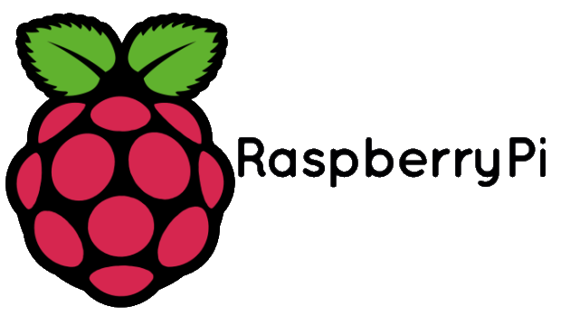
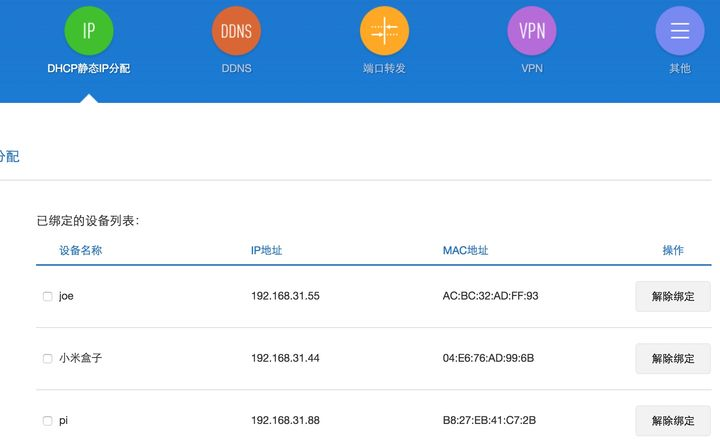
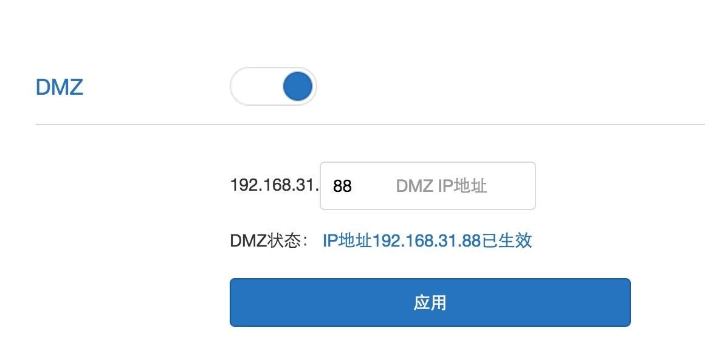

<!-- # 把树莓派变成24小时运行的下载神器（种子、磁力链通通支持） -->
## 背景介绍
树莓派买回来后干什么呢？先驱们告诉我：玩几天就腻了，等着放犄角旮旯里吃灰吧。

我研究了网上的树莓派玩法资料 ，发现如果没有买其他扩展硬件的话，用树莓派搭建一个24小时开机的下载服务器是个不错的选择。

#### 遇到的难点和解决办法
既然是下载服务器就不能只在家里使用，需要支持远程访问。那么问题来了，目前家里安装的都是联通的ADSL，公网IP是经常发生变化的，如何实时获取家里树莓派的IP地址进行访问呢？

#### 解决办法如下：

首先登录家里的路由器，给树莓派指定一个固定的静态内网IP地址。

使用路由器里的DHCP静态IP分配功能指定IP地址（基本所有路由器都有这个功能，但菜单位置不一样）

这里我设置了192.168.31.88 作为树莓派的静态内网IP地址。

然后开启路由器里的DMZ功能，指向这个静态IP地址，这样通过公网IP就能访问到树莓派了。
那如何实时获取公网地址呢？

写了下面一段Python代码，实现的方法是：

通过访问采集 http://members.3322.org/dyndns/getip 获取到公网IP地址，然后借用163邮箱给自己的QQ邮箱发信。（发件和收件邮箱一致也可以，主要考虑163邮箱设置SMTP方便，QQ可以自动弹出邮件通知。）
```python
#!/usr/bin/python
# -*- coding: UTF-8 -*-

import smtplib
import string
from email.MIMEMultipart import MIMEMultipart
from email.MIMEText import MIMEText
import urllib
import urllib2

user_agent = 'Mozilla/4.0 (compatible; MSIE 10.0; Windows NT)'
headers = {}
headers['User-Agent'] = user_agent
url = 'http://members.3322.org/dyndns/getip'   # 通过这个接口获取公网IP地址
req = urllib2.Request(url, headers = headers)
res = urllib2.urlopen(req)

ip = string.strip(res.read())   # 去除空格
print ip

fromaddr = "xiangyangqiaomu@163.com"  # 填写你的发信邮箱，我选用的是163邮箱
toaddr = "85378058@qq.com"   # 填写你的收信地址，接收树莓派的公网IP地址
msg = MIMEMultipart()
msg['From'] = fromaddr
msg['To'] = toaddr
msg['Subject'] = 'rasperberry IP is ' + ip   # 邮件标题

body = 'rasperberry IP is ' + ip   # 邮件内容，同标题（偷懒）
msg.attach(MIMEText(body, 'plain'))

server = smtplib.SMTP('smtp.163.com', 25)   # 填写163邮箱的发信服务器地址
server.starttls()
server.login(fromaddr, "xxx")   # xxx代表你的邮件登录密码
text = msg.as_string()
server.sendmail(fromaddr, toaddr, text) # 开始发邮件
print u"send ok"  # 发送成功提示
server.quit()
```
运行这个python文件后就发信成功了。
>注意,千万不要把这个python文件命名为email.py，会报错，换个名字，比如叫sendemail.py

如何定时运行这个程序发邮件呢？
需要先写一个执行这个程序的脚本，代码如下：
```bash
#!/bin/sh
python /home/pi/code/sendemail.py
```
存个名字叫 getip.sh

在树莓派的终端里输入 crontab -e 这个是系统自带的定时程序，具体用法可以Google

这时会进入编辑界面，输入如下代码（意思是每隔30分钟执行一次getip.sh这个脚本）
```bash
*/30 * * * * /home/pi/code/getip.sh
```
这样，每隔30分钟你的邮箱里就会有一封告知你现在树莓派公网IP的邮件。

### 如何改造成下载机呢？
有了公网IP地址，就可以远程通过SSH登录到树莓派主机了，可如何变成下载机呢？

这时Linux下最强大的下载工具Aria2就要出场了。

据说可以下载百度云，迅雷离线中的资源，支持http/https/ftp/bt协议，支持metalink 3.0，metalink是一种可以将不同协议下载的同一文件集合到一起以达到最大下载稳定性和速度的东西。

安装配置参考这篇文章：Raspberry Pi从零开始搭建低成本NAS(7)-Aria2远程下载

按照步骤一步步操作，比较顺利。

最后还安装了webui-aria2，这样就可以通过Web界面方式添加下载任务了。

注意：Web服务器可以选择Apache或Nginx都可以，但配置端口的时候一定不要用80或8080，因为都被联通封掉了。

点击添加就可以创建不同协议的下载任务，http/ftp和磁力链都选链接下载，也可以上传BT种子下载。

### 让闲置的移动硬盘跑起来
树莓派的系统是安装在SD卡里，容量只有32G，速度也不快。刚好想起来我还有块闲置了快10年的500G移动硬盘。

看了很多文章都说树莓派带不起来移动硬盘，因为电压不够，需要外接电源或使用带电源的USB Hub。

但我尝试把移动硬盘插上去的时候，居然可以识别而且运转良好。可能树莓派3b+升级了？

参考教程安装了Samba以实现文件共享：http://www.cnblogs.com/xiaowuyi/p/4051238.html

注意事项：

1. 建议把移动硬盘的某个分区格式化为ext4格式，否则aria2下载无法写入。
2. 如果有分区是NTFS格式的，需要装软件 sudo apt-get install fuse-utils ntfs-3g 否则分区是只读状态。
3. 插上去移动硬盘或U盘是不能直接用的，需要挂载。教程地址
安装设置好Samba服务后，电脑也可以访问到移动硬盘了。

如果是Mac电脑，打开Finder -> 前往 -> 连接服务器，然后输入 smb://user@xxx.xxx.xxx.xxx

这时会要求输入smba用户密码，然后就登录成功了，以后远程就可以访问自己的移动硬盘了，甚至可以直接播放视频。