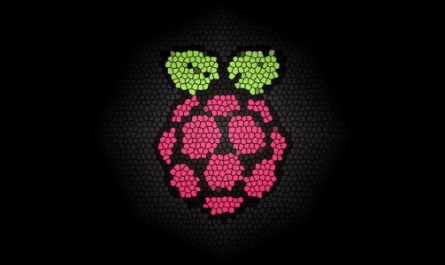

<!-- # 树莓派之实现简单的家庭NAS -->
## 安装Samba实现文件共享
### 第一部分：挂载硬盘。
首先作者是将u盘作为盘储存数据，但是FAT格式支持不好，所以就先把u盘格式化成ext格式再进行其他操作
#### 1. 查看u盘的序号
```bash
sudo fdisk -l
```
查看树莓派的存储数据

##### 2. 卸载该分区
```bash
sudo umount /dev/sda1
```
##### 3. 格式化为ext4分区
```bash
sudo mkfs.ext4 /dev/sda1
```

#### 4. 测试u盘是否可用
创建要挂载的文件夹并修改权限
```bash
sudo mkdir /samba
sudo chmod 777 /samba
```
查看硬盘设备目录
```bash
sudo fdisk -l
```

确定最后一个是u盘，所以将u盘挂载到samba目录下
```bash
#挂载硬盘
sudo mount -t ext4 /dev/sda1 /samba
cd /samba
#如果成功进入并 ls 读取到内容便可进行下一步
5. 实现开机自动挂载到指定目录
#编辑fstab让u盘能够自动开机挂载
sudo nano /etc/fstab
#在后面添加一行内容
/dev/sda1 /samba ext4 defaults 0 0
#保存重启即可生效
```
### 第二部分：安装samba服务，搭建NAS系统
#### 1. 安装samba
```bash
sudo apt-get install samba samba-common-bin
sudo apt-get install netatalk （可选，用于支持AFP）
sudo apt-get install avahi-daemon（可选，用于支持网内的计算机自动发现）
#### 2.配置conf文件
[share]
 comment = share
 path = /samba
 read only = no
 create mask = 0777
 directory mask = 0777
 guest ok = yes
 browseable = yes
 public = yes
 writable = yes
#### 3.测试配置是否有错
```bash
#输入名称，检测配置是否有错
testparm
```

#### 4. 重启samba服务
```bash
smbd restart
```
#### 5. 为samba添加用户名和密码
```bash
sudo smbpasswd -a pi
```
#### 6. 现在已经能够在局域网内访问samba了，在网上邻居访问树莓派


#### 7. 测试能否远程在树莓派硬盘内添加文件
在win10系统下添加一个文件到树莓派的share文件夹下，在树莓派端查看

在树莓派端查看也有pi文件夹，证明远程创建文件成功！！！