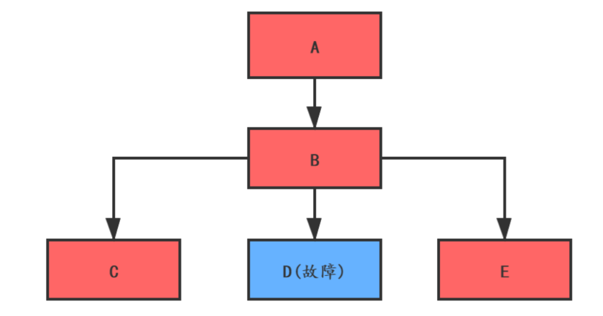
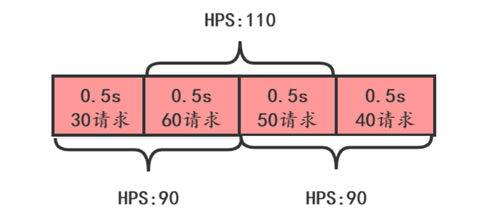
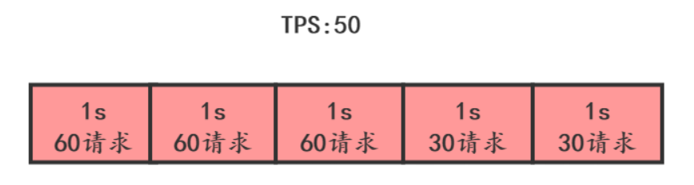
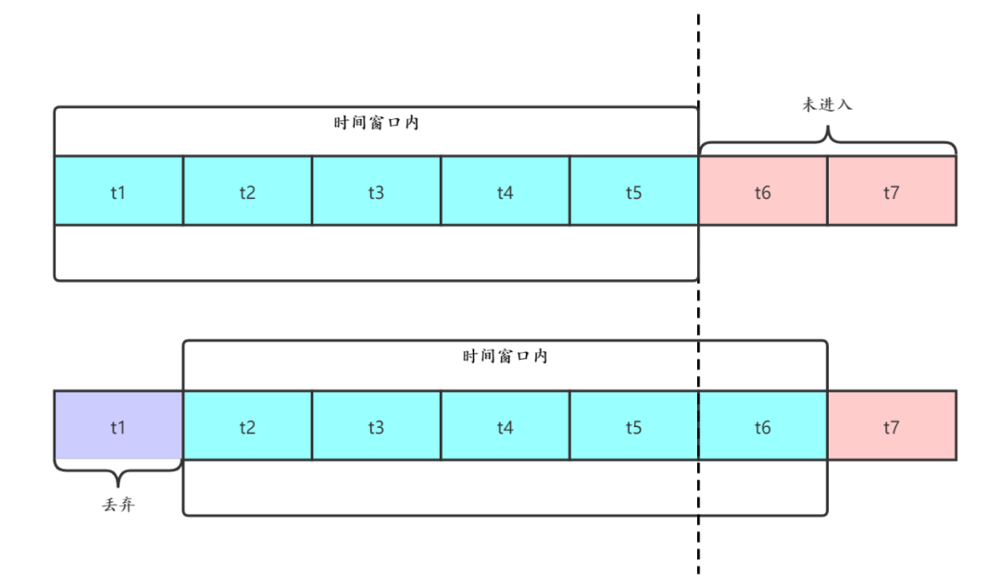
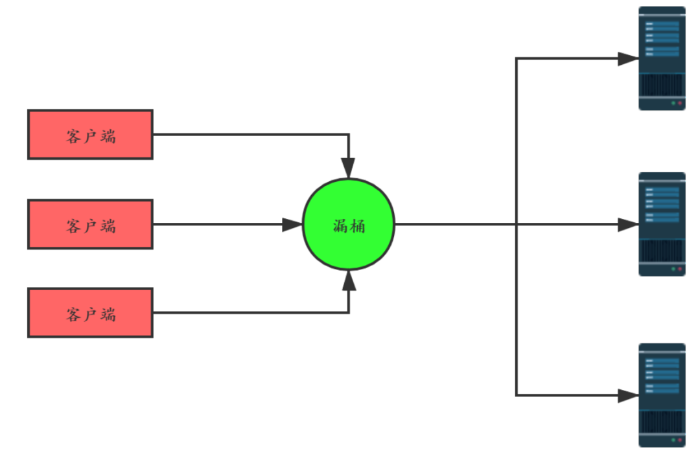
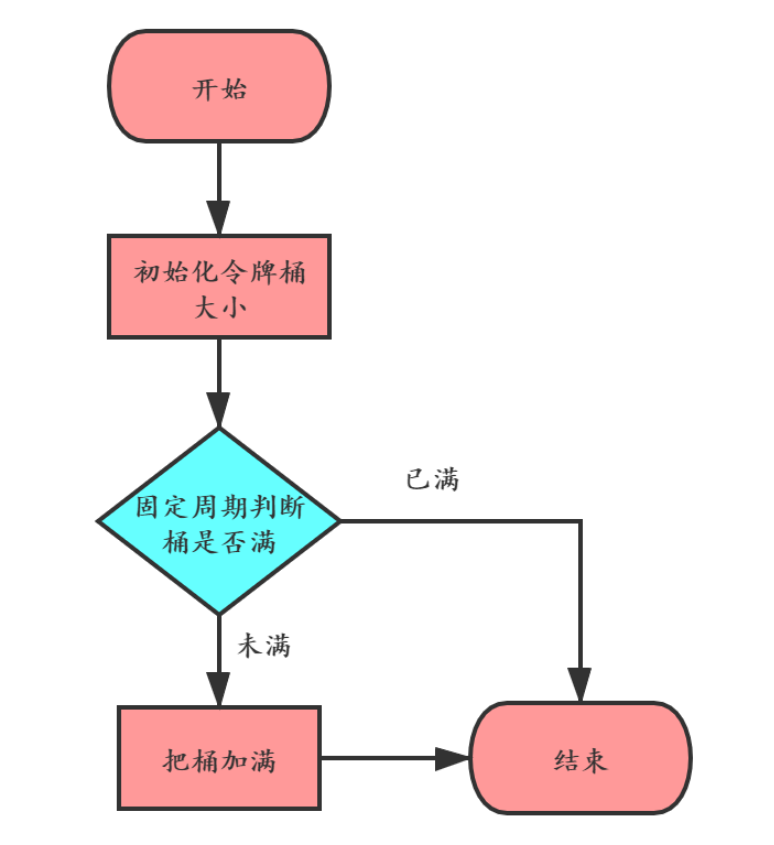
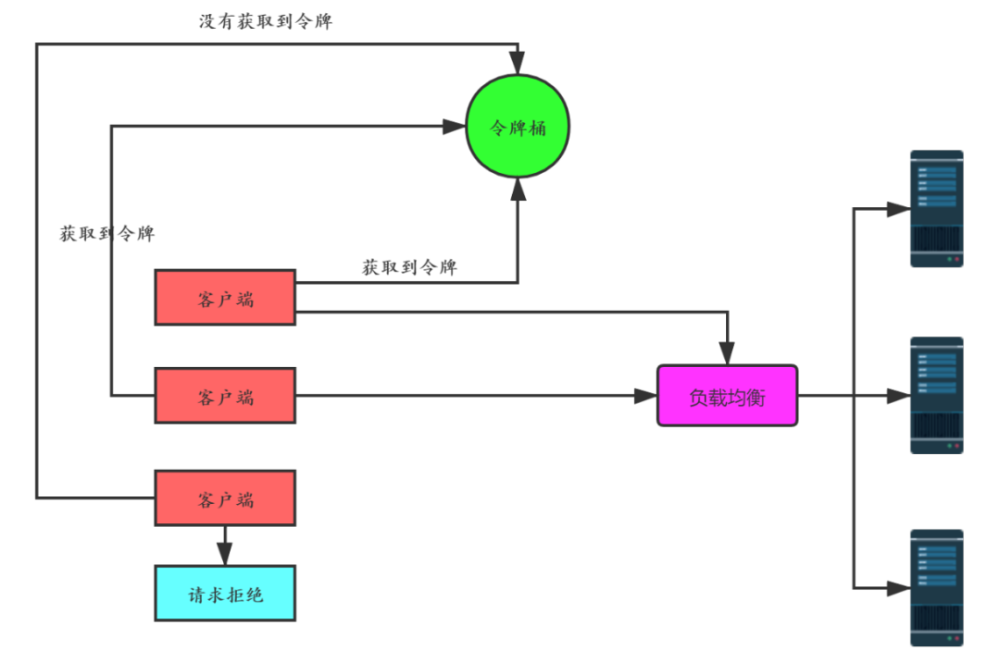
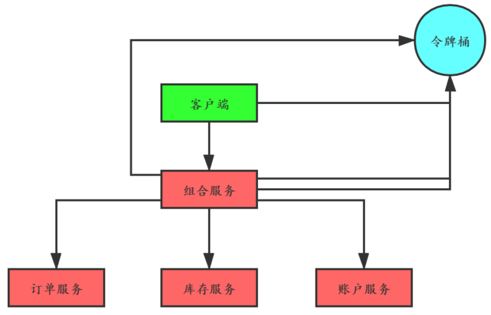

## 引言
在分布式系统中，如果某个服务节点发生故障或者网络发生异常，都有可能导致调用方被阻塞等待，如果超时时间设置很长，调用方资源很可能被耗尽。这又导致了调用方的上游系统发生资源耗尽的情况，最终导致系统雪崩。
如下图：如果D服务发生了故障不能响应，B服务调用D时只能阻塞等待。假如B服务调用D服务设置超时时间是10秒，请求速率是每秒100个，那10秒内就会有1000个请求线程被阻塞等待，如果B的线程池大小设置1000，那B系统因为线程资源耗尽已经不能对外提供服务了。而这又影响了入口系统A的服务，最终导致系统全面崩溃。

提高系统的整体容错能力是防止系统雪崩的有效手段。

要防止系统发生雪崩，就必须要有容错设计。如果遇到突增流量，一般的做法是**对非核心业务功能采用熔断和服务降级的措施来保护核心业务功能正常服务**，而**对于核心功能服务，则需要采用限流的措施**。

---

## 限流方法
### 1. 流量计数器
这是最简单直接的方法，比如限制每秒请求数量100，超过100的请求就拒绝掉。

但是这个方法存在2个明显的问题：
* 单位时间(比如1s)很难把控，如下图：这张图上，从下面时间看，HPS没有超过100，但是从上面看HPS超过100了。
* 有一段时间流量超了，也不一定真的需要限流，如下图，系统HPS限制50，虽然前3s流量超了，但是如果读超时时间设置为5s，并不需要限流。
  
### 2. 滑动时间窗口(sentinel使用)
滑动时间窗口算法是目前比较流行的限流算法，主要思想是把时间看做是一个向前滚动的窗口，如下图：开始的时候，我们把t1~t5看做一个时间窗口，每个窗口1s，如果我们定的限流目标是每秒50个请求，那t1~t5这个窗口的请求总和不能超过250个。

这个窗口是滑动的，下一秒的窗口成了t2~t6，这时把t1时间片的统计抛弃，加入t6时间片进行统计。这段时间内的请求数量也不能超过250个。

滑动时间窗口的优点是解决了流量计数器算法的缺陷，但是也有2个问题：
- 流量超过就必须抛弃或者走降级逻辑
- 对流量控制不够精细，不能限制集中在短时间内的流量，也不能削峰填谷

### 3. 漏桶算法
漏桶算法的思想如下图：在客户端的请求发送到服务器之前，先用漏桶缓存起来，这个漏桶可以是一个长度固定的队列，这个队列中的请求均匀的发送到服务端。

如果客户端的请求速率太快，漏桶的队列满了，就会被拒绝掉，或者走降级处理逻辑。这样服务端就不会受到突发流量的冲击。

漏桶算法的优点是实现简单，可以使用消息队列来削峰填谷。

但是也有3个问题需要考虑:
-漏桶的大小，如果太大，可能给服务端带来较大处理压力，太小可能会有大量请求被丢弃。
-漏桶给服务端的请求发送速率。
-使用缓存请求的方式，会使请求响应时间变长。
>漏桶大小和发送速率这2个值在项目上线初期都会根据测试结果选择一个值，但是随着架构的改进和集群的伸缩，这2个值也会随之发生改变。

### 4. 令牌桶算法

令牌桶算法就跟病人去医院看病一样，找医生之前需要先挂号，而医院每天放的号是有限的。当天的号用完了，第二天又会放一批号。

算法的基本思想就是周期性的执行下面的流程：客户端在发送请求时，都需要先从令牌桶中获取令牌，如果取到了，就可以把请求发送给服务端，取不到令牌，就只能被拒绝或者走服务降级的逻辑。如下图：

>令牌桶算法解决了漏桶算法的问题，而且实现并不复杂，使用信号量就可以实现。在实际限流场景中使用最多，比如google的guava中就实现了令牌桶算法限流，感兴趣可以研究一下。

### 5. 分布式限流
如果在分布式系统场景下，上面介绍的4种限流算法是否还适用呢？

以令牌桶算法为例，假如在电商系统中客户下了一笔订单，如下图：如果我们把令牌桶单独保存在一个地方(比如redis中)供整个分布式系统用，那客户端在调用组合服务，组合服务调用订单、库存和账户服务都需要跟令牌桶交互，交互次数明显增加了很多。

有一种改进就是客户端调用组合服务之前首先获取四个令牌，调用组合服务时减去一个令牌并且传递给组合服务三个令牌，组合服务调用下面三个服务时依次消耗一个令牌。