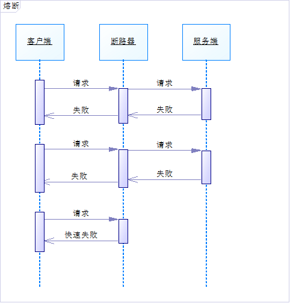
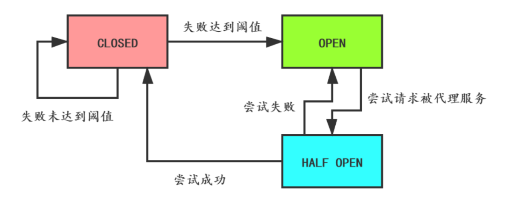

## 服务熔断
相信大家对断路器并不陌生，它就相当于一个开关，打开后可以阻止流量通过。比如保险丝，当电流过大时，就会熔断，从而避免元器件损坏。

服务熔断是指调用方访问服务时通过断路器做代理进行访问，断路器会持续观察服务返回的成功、失败的状态，当失败超过设置的阈值时断路器打开，请求就不能真正地访问到服务了。

为了更好地理解，我画了下面的时序图：
### 1. 断路器的状态
断路器有3种状态：
- CLOSED：默认状态。断路器观察到请求失败比例没有达到阈值，断路器认为被代理服务状态良好。
- OPEN：断路器观察到请求失败比例已经达到阈值，断路器认为被代理服务故障，打开开关，请求不再到达被代理的服务，而是快速失败。
- HALF OPEN：断路器打开后，为了能自动恢复对被代理服务的访问，会切换到半开放状态，去尝试请求被代理服务以查看服务是否已经故障恢复。如果成功，会转成**CLOSED**状态，否则转到**OPEN**状态。

断路器的状态切换图如下：

### 2. 需要考虑的问题
使用断路器需要考虑一些问题：
1. 针对不同的异常，定义不同的熔断后处理逻辑。
2. 设置熔断的时长，超过这个时长后切换到HALF OPEN进行重试。
3. 记录请求失败日志，供监控使用。
4. 主动重试，比如对于`connection timeout`造成的熔断，可以用异步线程进行网络检测，比如`telenet`，检测到网络畅通时切换到`HALF OPEN`进行重试。
5. 补偿接口，断路器可以提供补偿接口让运维人员手工关闭。
6. 重试时，可以使用之前失败的请求进行重试，但一定要注意业务上是否允许这样做。
### 3. 使用场景
* 服务故障或者升级时，让客户端快速失败
* 失败处理逻辑容易定义
* 响应耗时较长，客户端设置的read timeout会比较长，防止客户端大量重试请求导致的连接、线程资源不能释放

---
## 服务降级
降级是从系统功能优先级的角度考虑如何应对系统故障。

服务降级指的是当服务器压力剧增的情况下，根据当前业务情况及流量对一些服务和页面有策略的降级，以此释放服务器资源以保证核心任务的正常运行。
### 1. 降级服务的特征
- **原因**: 整体负荷超出整体负载承受能力。
- **目的**: 保证重要或基本服务正常运行，非重要服务延迟使用或暂停使用
- **大小**: 降低服务粒度，要考虑整体模块粒度的大小，将粒度控制在合适的范围内
- **可控性**: 在服务粒度大小的基础上增加服务的可控性，后台服务开关的功能是一项必要配置(单机可配置文件，其他可领用数据库和缓存)，可分为手动控制和自动控制。
- **次序**: 一般从外围延伸服务开始降级，需要有一定的配置项，重要性低的优先降级比如可以分组设置等级1-10，当服务需要降级到某一个级别时，进行相关配置
### 2. 服务降级的分类 
降级按照是否自动化可分为:

- 自动开关降级(超时、失败次数、故障、限流)
- 人工开关降级(秒杀、电商大促等)

**自动降级**分类又分为:

- **超时降级**:主要配置好超时时间和超时重试次数和机制，并使用异步机制探测回复情况
- **失败次数降级**:主要是一些不稳定的api，当失败调用次数达到一定阀值自动降级，同样要使用异步机制探测回复情况
- **故障降级**:比如要调用的远程服务挂掉了(网络故障、DNS故障、http服务返回错误的状态码、rpc服务抛出异常)，则可以直接降级。降级后的处理方案有:默认值(比如库存服务挂了，返回默认现货)、兜底数据(比如广告挂了，返回提前准备好的一些静态页面)、缓存(之前暂存的一些缓存数据)
- **限流降级**:当我们去秒杀或者抢购一些限购商品时，此时可能会因为访问量太大而导致系统崩溃，此时开发者会使用限流来进行限制访问量，当达到限流阀值，后续请求会被降级:降级后的处理方案可以是:排队页面(将用户导流到排队页面等一会重试)无货(直接告知用户没货了)、错误页(如活动太火爆了，稍后重试)
### 3. 大规模分布式系统如何降级 
在大规模分布式系统中，经常会有成百上千的服务。在大促前往往会根据业务的重要程度和业务间的关系批量降级。这就需要技术和产品提前对业务和系统进行梳理，根据梳理结果确定哪些服务可以降级，哪些服务不可以降级，降级策略是什么，降级顺序怎么样，大型互联网公司基本都会有自己的降级平台，大部分降级都在平台上握作，比如手动降级开关，批量降级顺序管理，熔断阈值动态设置，限流阈值动态设置等等。 

---
## 总结
限流、熔断和服务降级是系统容错的重要设计模式，从一定意义上讲限流和熔断也是一种服务降级的手段。

熔断和服务降级主要是针对非核心业务功能，而核心业务如果流程超过预估的峰值，就需要进行限流。

对于限流，选择合理的限流算法很重要，令牌桶算法优势很明显，也是使用最多的限流算法。

在系统设计的时候，这些模式需要配合业务量的预估、性能测试的数据进行相应阈值的配置，而这些阈值最好保存在配置中心，方便实时修改。