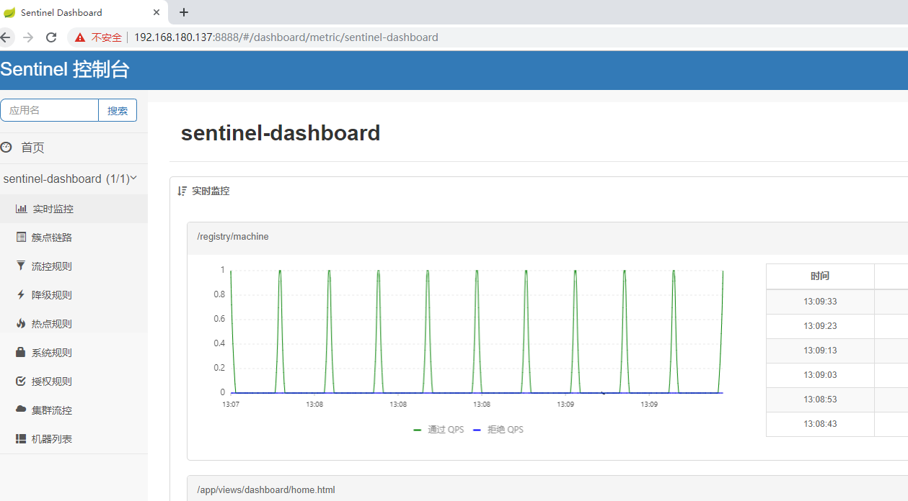
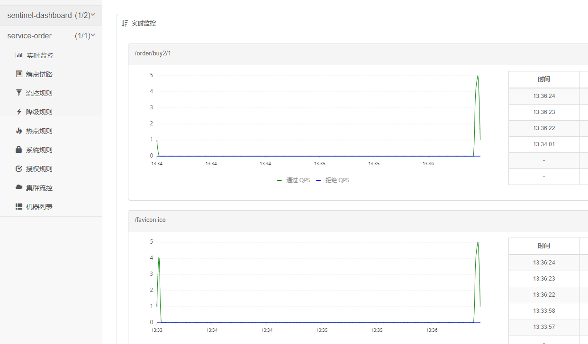

[toc]
## sentinel服务启动
``` bash
java  -server -Xms64m -Xmx256m  -Dserver.port=8849 -Dcsp.sentinel.dashboard.server=localhost:8849 -Dproject.name=sentinel-dashboard -jar /work/sentinel-dashboard-1.7.1.jar 
```
开机启动：启动命令可以加入到启动的 rc.local 配置文件， 之后做到开机启动
```bash
##启动 sentinel

/usr/bin/su - root -c “nohup java -server -Xms64m -Xmx256m -Dserver.port=8849 -Dcsp.sentinel.dashboard.server=localhost:8849 -Dproject.name=sentinel-dashboard -jar /work/sentinel-dashboard-1.7.1.jar 2>&1 &”
```
除了流量控制以外，对调用链路中不稳定的资源进行熔断降级也是保障高可用的重要措施之一。

由于调用关系的复杂性，如果调用链路中的某个资源不稳定，最终会导致请求发生堆积。Sentinel 熔断降级会在调用链路中某个资源出现不稳定状态时（例如调用超时或异常比例升高），对这个资源的调用进行限制，让请求快速失败，避免影响到其它的资源而导致级联错误。当资源被降级后，在接下来的降级时间窗口之内，对该资源的调用都自动熔断（默认行为是抛出 DegradeException）。

关于熔断降级的介绍见：Sentinel熔断降级。

下面就使用基于注解的方式实现Sentinel的熔断降级的demo。

>注意：启动 Sentinel 控制台需要 JDK 版本为 1.8 及以上版本。

使用如下命令启动控制台：
```bash
nohup java  -server -Xms64m -Xmx256m  -Dserver.port=8849 -Dcsp.sentinel.dashboard.server=localhost:8849 -Dproject.name=sentinel-dashboard -jar /work/sentinel-dashboard-1.7.1.jar &
```
其中 -Dserver.port=8849用于指定 Sentinel 控制台端口为 8849 ， 这个端口可以按需指定。

从 Sentinel 1.6.0 起，Sentinel 控制台引入基本的登录功能，默认用户名和密码都是 sentinel。可以参考 鉴权模块文档 配置用户名和密码。

>注：若您的应用为 Spring Boot 或 Spring Cloud 应用，您可以通过 Spring 配置文件来指定配置，详情请参考 Spring Cloud Alibaba Sentinel 文档。（1）获取 Sentinel 控制台
您可以从官方 网站中 下载最新版本的控制台 jar 包，下载地址如下：https://github.com/alibaba/Sentinel/releases/download/1.6.3/sentinel-dashboard-1.7.1.jar

### 启动
使用如下命令启动控制台：
```bash
[root@192 ~]# java -Dserver.port=8888 -Dcsp.sentinel.dashboard.server=localhost:8888 -Dproject.name=sentinel-dashboard -jar sentinel-dashboard-1.6.3.jar
INFO: log base dir is: /root/logs/csp/
INFO: log name use pid is: false

  .   ____          _            __ _ _
 /\\ / ___'_ __ _ _(_)_ __  __ _ \ \ \ \
( ( )\___ | '_ | '_| | '_ \/ _` | \ \ \ \
 \\/  ___)| |_)| | | | | || (_| |  ) ) ) )
  '  |____| .__|_| |_|_| |_\__, | / / / /
 =========|_|==============|___/=/_/_/_/
 :: Spring Boot ::        (v2.0.5.RELEASE)

2020-02-08 13:07:29.316  INFO 114031 --- [           main] c.a.c.s.dashboard.DashboardApplication   : Starting DashboardApplication on 192.168.180.137 with PID 114031 (/root/sentinel-dashboard-1.6.3.jar started by root in /root)
2020-02-08 13:07:29.319  INFO 114031 --- [           main] c.a.c.s.dashboard.DashboardApplication   : No active profile set, falling back to default profiles: default
2020-02-08 13:07:29.456  INFO 114031 --- [           main] ConfigServletWebServerApplicationContext : Refreshing org.springframework.boot.web.servlet.context.AnnotationConfigServletWebServerApplicationContext@59690aa4: startup date [Sat Feb 08 13:07:29 CST 2020]; root of context hierarchy
2020-02-08 13:07:33.783  INFO 114031 --- [           main] o.s.b.w.embedded.tomcat.TomcatWebServer  : Tomcat initialized with port(s): 8888 (http)
```
其中 - Dserver.port=8888 用于指定 Sentinel 控制台端口为 8888 。
从 Sentinel 1.6.0 起，Sentinel 控制台引入基本的登录功能，默认用户名和密码都是 sentinel 。可以参考 鉴权模块文档 配置用户名和密码。


### 查看机器列表以及健康情况
默认情况下Sentinel 会在客户端首次调用的时候进行初始化，开始向控制台发送心跳包。也可以配置
sentinel.eager=true ,取消Sentinel控制台懒加载。
打开浏览器即可展示Sentinel的管理控制台

## 客户端能接入控制台
控制台启动后，客户端需要按照以下步骤接入到控制台。

1. 父工程引入 alibaba实现的SpringCloud
   ```xml
   <dependencyManagement>
        <dependencies>
            <dependency>
                <groupId>org.springframework.cloud</groupId>
                <artifactId>spring-cloud-dependencies</artifactId>
                <version>Greenwich.RELEASE</version>
                <type>pom</type>
                <scope>import</scope>
            </dependency>
            <dependency>
                <groupId>com.alibaba.cloud</groupId>
                <artifactId>spring-cloud-alibaba-dependencies</artifactId>
                <version>2.1.0.RELEASE</version>
                <type>pom</type>
                <scope>import</scope>
            </dependency>
        </dependencies>
    </dependencyManagement>
    ```
2. 子工程中引入 sentinel
   ```xml
   <dependency>
            <groupId>com.alibaba.cloud</groupId>
            <artifactId>spring-cloud-starter-alibaba-sentinel</artifactId>
        </dependency>
    ```
3. 配置启动参数
   在工程的application.yml中添加Sentinel 控制台配置信息
   ``` yml
   spring:
    cloud:
        sentinel:
        transport:
            dashboard: 192.168.180.137:8888   #sentinel控制台的请求地址
    ```
    这里的 `spring.cloud.sentinel.transport.dashboard` 配置控制台的请求路径。