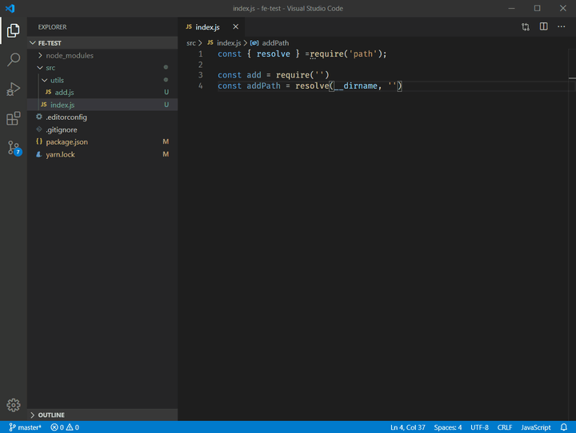
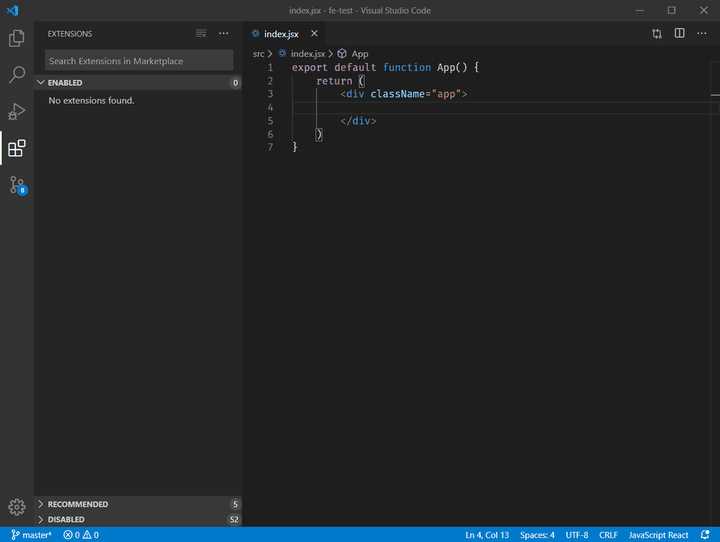
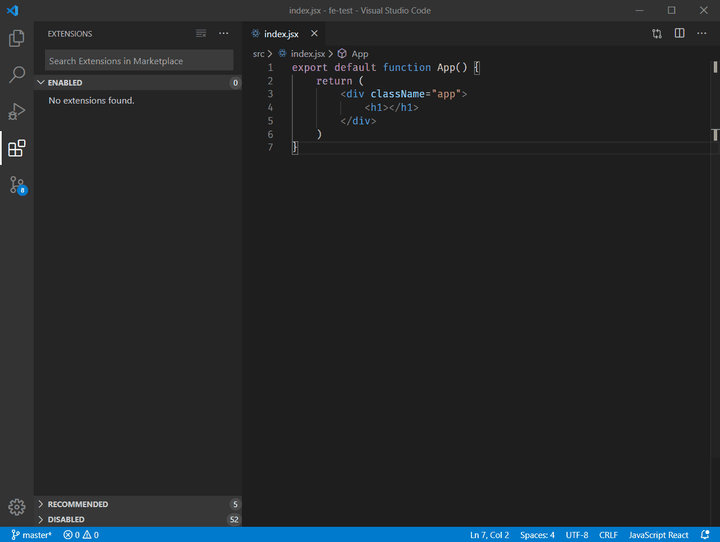
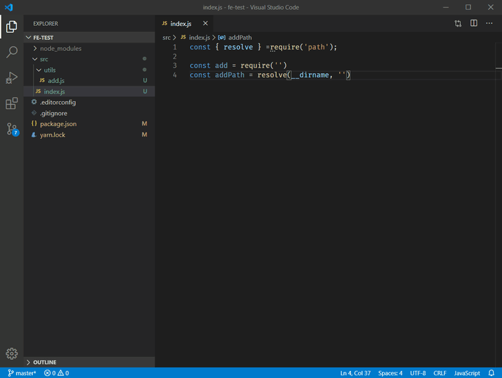
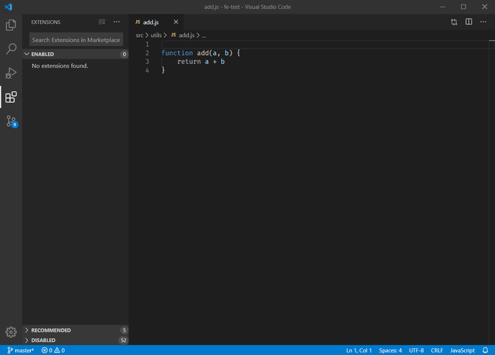
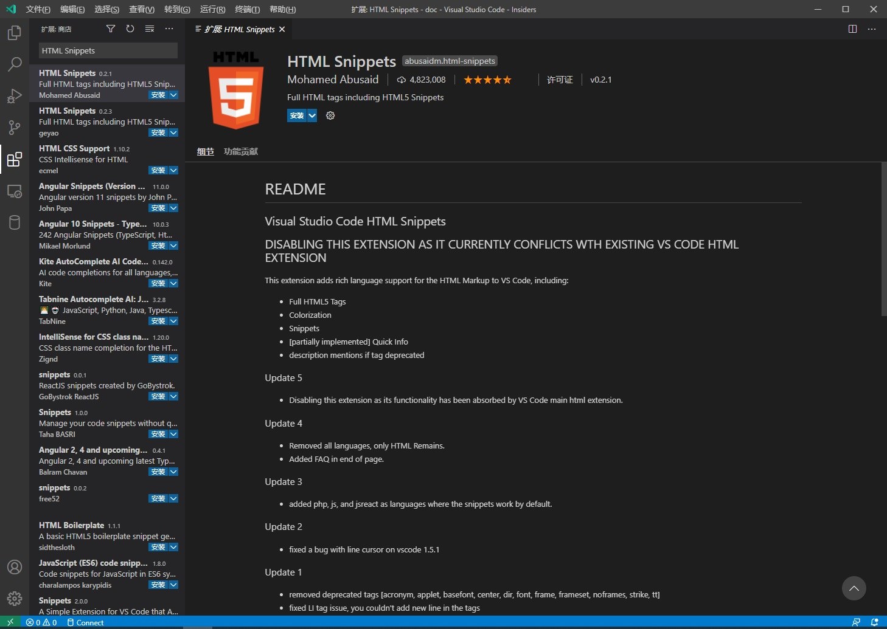

# 
这篇文章可能会得罪一部分 VSCode 扩展的作者，但是我实在是看不惯网上很多的文章还在推荐一些已经过时的扩展，我觉得作为 VSCode 的老粉，我有必要写一篇文章科普一下。

在 VSCode 扩展市场目前其实存在着不少下载量特别高但是不应该再被使用的扩展，显然官方是不可能直接给你标出来哪些扩展已经被废弃了，哪些有严重 bug，纯靠扩展作者自觉。很多人新人由于没有深入去了解过，看了一些文章的介绍或者看了扩展市场的简介觉得有用就安装了，其实 VSCode 扩展安装多了会导致不少问题的：

1. **启动慢**，很多扩展是启动 VSCode 的时候就开始加载的，所以不一定是 VSCode 自身变慢了，可能是你扩展装多了。你可以通过在 VSCode 的命令面板调用命令 Developer: Startup Performance 查看各个扩展的在 VSCode 启动时的加载时间。
2. **扩展之间冲突**，比如安装了多个会修改代码颜色的扩展，TODO highlight 和 Todo Tree 之间
3. **功能重复**，例如：IntelliSense for CSS class names in HTML 和 HTML CSS Support
4. **CPU 占用过高**，很多被弃坑的 VSCode 扩展你去看它们 github issues 页面都可以看到一堆 issues 抱怨这个问题，例如 import-cost
   
本文将主要从两个角度介绍一些不推荐使用的 VSCode 扩展：

1. 功能已经被 VSCode 内置
2. 维护不积极的扩展
本文只是给出一些你应该考虑卸载的理由，不是劝说你就应该卸载它们。有些扩展虽然有些问题，但是还是有部分功能没有被内置或者暂时没有更好的替代品，但是我觉得这些事情你应该要清楚。由于本人目前主要是用 VSCode 做前端开发，所以文章中涉及到的扩展大多是和前端相关的。

## 功能已经被 VSCode 内置
文中列出的数据为文章最后更新时的数据，不保证具有时效性，Last updated 为该扩展最后一次发布到 VSCode 扩展市场的时间。

### [Path Intellisense](https://marketplace.visualstudio.com/items?itemName=christian-kohler.path-intellisense)
    Last updated: 2017/5/11
    Issues open/close: 73/63
    Download: 2.7M
我经常看到一些使用 VSCode 没几天的人喷没有路径补全，我觉得很莫名其妙。可以看到这个扩展已经快 3 年没维护了，这也是一个应该放弃使用它的理由。其实如果一个工具本身功能完善，没什么 bug，没有依赖别的项目的话，长期不更新倒没什么。但实际上很多项目都会依赖别的项目，尤其是使用 JS 开发的 VSCode 扩展，经常可以看到各种 npm 包报安全漏洞，最近一次影响比较大的应该是 [acorn](https://app.snyk.io/vuln/SNYK-JS-ACORN-559469)。

其实 VSCode 自身已经支持在 import/require 也就是导入语句中使用路径补全，但是在其它场景中写路径字符串时还是没有提示。如果你觉得在导入语句中有路径补全已经能够满足你的使用需求，那我觉得这个插件可以考虑卸载了。类似的还有 [Path Autocomplete](https://marketplace.visualstudio.com/items?itemName=ionutvmi.path-autocomplete)。

### [Auto Close Tag](https://marketplace.visualstudio.com/items?itemName=formulahendry.auto-close-tag)
    Last updated: 2018/2/17
    Issues open/close: 100/59
    Download: 2.6M
从侧边栏可以看到我一个扩展都没打开，实测在 HTML, js, jsx, tsx 文件中已经内置支持自动闭合标签功能，但是 vue 还是不支持，可以看一下我提的 issue：auto close tag doesn't work in vue file。

这个扩展的作者开发了很多优秀的 VSCode 扩展，包括这个和下面的 Auto Rename Tag，最有名的应该是 [Code Runner](https://marketplace.visualstudio.com/items?itemName=formulahendry.auto-close-tag)。我觉得有些扩展的功能被内置一方面也是好事，毕竟人的精力是有限的，维护开源项目还是很累的。

### [Auto Rename Tag](https://marketplace.visualstudio.com/items?itemName=formulahendry.auto-rename-tag)
    Last updated: 2019/10/27
    Issues open/close: 453/71
    Download: 2.6M
直接使用快捷键 F2 重构即可，不需要安装扩展。auto close tag 和 auto rename tag 的扩展包 [Auto Complete Tag](https://marketplace.visualstudio.com/items?itemName=formulahendry.auto-complete-tag) 也可以考虑卸载了。

通过设置 "editor.renameOnType": true（默认没开启），你可以达到和 auto rename tag 一毛一样的效果 , 如果你想只在某种特定语言中开启这个特性，可以参考下面的配置：
```json
// settings.json
"[html]": {
    "editor.renameOnType": true,
  },
```
还有一款也是这个作者开发的扩展 Terminal 早就在 2017/7/22 就不维护了，下载量高达 581 K。不维护的理由作者在扩展主页上也说了，一个是 Code Runner 的功能比它还多，另一个是 VSCode 已经内置了这个扩展的部分功能。

### [npm Intellisense](https://marketplace.visualstudio.com/items?itemName=christian-kohler.npm-intellisense)
    Last updated: 2017/2/23
    Issues open/close: 27/19
    Download: 2M
这个扩展的功能是支持在导入语句中提供 npm 模块补全，从最后更新时间来推测这个功能应该 3 年前就被内置支持，但是下载量很恐怖啊，github 上还能看到 9 天前提的 issue，人间迷惑行为。

和这个扩展功能相同，下载量同样非常高的另一个扩展是: [Node.js Modules Intellisense](https://marketplace.visualstudio.com/items?itemName=leizongmin.node-module-intellisense)。

### [Document This](https://marketplace.visualstudio.com/items?itemName=joelday.docthis)
    Last updated: 2018/6/4
    Issues open/close: 64/124
    Download: 638K
VSCode 已经内置自动生成 jsdoc 和注释补全功能。

### [HTML Snippets](https://marketplace.visualstudio.com/items?itemName=abusaidm.html-snippets)
    Last updated: 2017/12/28
    Issues open/close: 19/21
    Download: 3.3M
这个扩展的下载量充分说明了有些人安装扩展只看名字，但凡瞅一眼这个扩展的主页也不会安装了:

## 维护不积极
### [Color Highlight](https://marketplace.visualstudio.com/items?itemName=naumovs.color-highlight)
    Last updated: 2017/7/12
    Issues open/close: 49/25
    Download: 894K
可以考虑 vscode-colorize 作为替代品。

### TODO Highlight
    Last updated: 2018/7/22
    Issues open/close: 45/93
    Download: 953K
推荐替代品 Todo Tree

### SVG Viewer
    Last updated: 2019//28
    Issues open/close: 21/20
    Download: 431K
这个扩展是个日本小哥开发的，该项目已经放弃维护，github 仓库 都已经被封存了，推荐国人开发的替代品：vscode-svg2。

### Regex Previewer
    Last updated: 2018/4/27
    Issues open/close: 23/13
    Download: 172K
推荐在线工具 regex101。

### vscode-fileheader
    Last updated: 2016/8/10
    Issues open/close: 19/5
    Download: 143K
这个扩展自从第一次发布之后就一直没更新过... 推荐国人开发的替代品：koroFileHeader。

### XML Tools
    Last updated: 2019/6/1
    Issues open/close: 53/171
    Download: 1.7M
从 github issues 来看貌似没人维护了，同类的推荐替代品是红帽的 XML。

## 其它一些不推荐使用的扩展

### Beautify
VSCode 内置的格式化器就是使用 js-beautify，但是前端界当前最流行的格式化工具是 prettier，建议安装 prettier，然后设置 VSCode 使用 prettier 作为格式化器。同样的道理，下载量奇高的 JS-CSS-HTML Formatter, Prettify JSON 等格式化插件也不推荐安装。
```json
// settings.json
"[javascript]": {
    "editor.defaultFormatter": "esbenp.prettier-vscode"
},
"[javascriptreact]": {
    "editor.defaultFormatter": "esbenp.prettier-vscode"
},
"[typescript]": {
    "editor.defaultFormatter": "esbenp.prettier-vscode"
},
"[typescriptreact]": {
    "editor.defaultFormatter": "esbenp.prettier-vscode"
},
"[json]": {
    "editor.defaultFormatter": "esbenp.prettier-vscode"
},
"[vue]": {
    "editor.defaultFormatter": "esbenp.prettier-vscode"
},
"[html]": {
    "editor.defaultFormatter": "esbenp.prettier-vscode"
},
"[css]": {
    "editor.defaultFormatter": "esbenp.prettier-vscode"
},
"[less]": {
    "editor.defaultFormatter": "esbenp.prettier-vscode"
},
"[scss]": {
    "editor.defaultFormatter": "esbenp.prettier-vscode"
},
"[markdown]": {
    "editor.defaultFormatter": "esbenp.prettier-vscode"
},
"[yaml]": {
    "editor.defaultFormatter": "esbenp.prettier-vscode"
}
```
### jshint
就没见几个开源项目还在用 jshint，推荐使用 ESLint。

### JavaScript (ES6) code snippetsJavaScript (ES6) code snippets
如果你平时开发 React，那你极大可能也安装了 ES7 React/Redux/GraphQL/React-Native snippets，你可以去对比它俩提供的 snippets，后者基本上覆盖了前者提供的 snippets，除了 commonjs 的导入语句，也就是说后者没有 rqr 和 mde 的两个代码片段。snippets 扩展装多了是会影响代码提示的速度的，因为每次显示的补全列表都是到对应语言的 snippets 里面过滤出来的。